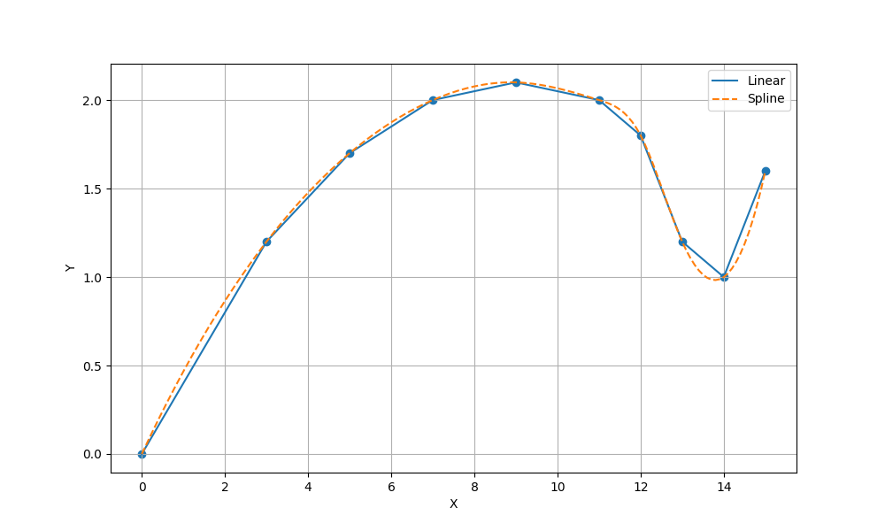
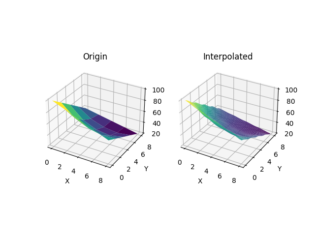

# 作业二

学号：BY2401147

姓名：王昌锐

## 第 1 题

待加工零件的外形根据工艺要求由一组数据 (x, y) 给出（在平面情况下），
用程控铣床加工时每一刀只能沿 x 方向和 y 方向走非常小的一步，
这就需要从已知数据得到加工所要求的步长很小的 (x, y) 坐标。
表 1 给出的 (x, y) 数据位于机翼断面的下轮廓线上，
假设需要得到 x 坐标每改变 0.1 时的 y 坐标，
分别用分段线性插值 (linear) 和分段三次方样条数据插值 (spline) 完成加工所需的据，
画出曲线。

表 1. 机翼断面下轮廓线上的部分数据
| x | 0 | 3   | 5   | 7   | 9   | 11  | 12  | 13  | 14  | 15  |
|---|---|-----|-----|-----|-----|-----|-----|-----|-----|-----|
| y | 0 | 1.2 | 1.7 | 2.0 | 2.1 | 2.0 | 1.8 | 1.2 | 1.0 | 1.6 |

> 源代码：
> ```
> using TyMath
> using PyPlot
> x = [0, 3, 5, 7, 9, 11, 12, 13, 14, 15]
> y = [0, 1.2, 1.7, 2.0, 2.1, 2.0, 1.8, 1.2, 1.0, 1.6]
> X = 0: 0.1: 15
> Y1 = interp1(x, y, X, "linear")
> Y2 = interp1(x, y, X, "spline")
> figure(figsize=(10, 6))
> scatter(x, y)
> plot(X, Y1, label="Linear")
> plot(X, Y2, label="Spline", linestyle="--")
> xlabel("X")
> ylabel("Y")
> legend()
> grid()
> savefig("./001.png")
> ```

> 运行结果：
> <div align="left">
> 
> </div>

## 第 2 题

实验中测得受热平板上各处的温度如表 2 所示，试分别计算以下两处的温度：
1. x = 4, y = 3.2
2. x = 4.3, y = 2.7
，并绘制位置与温度的二维曲面图。

表 2. 受热平板上各处的温度数据

|   | x = 0 | x = 2 | x = 4 | x = 6 | x = 8 |
|---|-------|-------|-------|-------|-------|
| y = 0 | 100   | 90    | 80    | 70    | 60    |
| y = 2 | 85    | 64.5  | 53.5  | 48.2  | 50    |
| y = 4 | 70    | 48.9  | 38.4  | 35    | 40    |
| y = 6 | 55    | 38.8  | 30.4  | 27.1  | 30    |
| y = 8 | 40    | 35    | 30    | 25    | 20    |

> 源代码：
> ```
> using TyMath
> using PyPlot
> using MeshGrid
> 
> x = 0:2:8
> y = 0:2:8
> X, Y = meshgrid(x, y)
> 
> T = [100 90 80 70 60;
> 85 64.5 53.5 48.2 50;
> 70 48.9 38.4 35 40;
> 55 38.8 30.4 27.1 30;
> 40 35 30 25 20]
> 
> fig = figure()
> ax1 = fig.add_subplot(121, projection="3d")
> ax1.plot_surface(X, Y, T, cmap="viridis")
> ax1.set_title("Origin")
> ax1.set_xlabel("X")
> ax1.set_ylabel("Y")
> 
> xq = 0:0.1:8
> yq = 0:0.1:8
> Xq, Yq = meshgrid(xq, yq)
> 
> Tq = interp2(X, Y, T, Xq, Yq, "makima")
> 
> ax2 = fig.add_subplot(122, projection="3d")
> ax2.plot_surface(Xq, Yq, Tq, cmap="viridis")
> ax2.set_title("Interpolated")
> ax2.set_xlabel("X")
> ax2.set_ylabel("Y")
> 
> println("T(4, 3.2) = ", Tq[40, 32])
> println("T(4.3, 2.7) = ", Tq[43, 27])
> savefig("./002.png")
> ```

> 运行结果：
> ```
> julia> 正在运行 2.3.jl
> T(4, 3.2) = 42.80367307335918
> T(4.3, 2.7) = 45.11157335273461
> ```

> <div align="left">
> 
> </div>