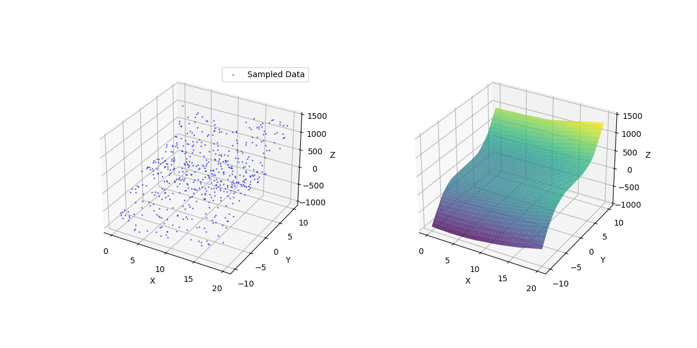

# 作业四

学号：BY2401147

姓名：王昌锐

## 第 1 题

用二元函数 $u = x_{2} + y_{3}$ ，在 $x ∈ [0, 20]$ 、 $y ∈ [-10, 10]$ 区域内抽样。
对所获得的数据，用人工神经网络建模，并作图绘出数据点和网络预测曲面。

> 源代码：
> ```Julia
> using MeshGrid
> using Random
> using TyDeepLearning
> using TyMachineLearning
> using TyMath
> using PyPlot
> 
> function target_function(x, y)
>     return x^2 + y^3
> end
> 
> function generate_data(N)
>     x_samples = rand(N) * 20
>     y_samples = rand(N) * 20 .- 10
>     u_samples = target_function.(x_samples, y_samples)
>     return x_samples, y_samples, u_samples
> end
> 
> function normalize(data)
>     min_val = minimum(data)
>     max_val = maximum(data)
>     return (data .- min_val) / (max_val - min_val), min_val, max_val
> end
> 
> function denormalize(data, min_val, max_val)
>     return data * (max_val - min_val) .+ min_val
> end
> 
> function train_network(x_samples, y_samples, u_samples, hidden_layer_sizes=(100, 100, 10), max_iter=10000, verbose=true)
>     x_norm, x_min, x_max = normalize(x_samples)
>     y_norm, y_min, y_max = normalize(y_samples)
>     u_norm, u_min, u_max = normalize(u_samples)
>     inputs = hcat(x_norm, y_norm)
>     outputs = u_norm
>     net = fitrnet(inputs, outputs, hidden_layer_sizes=hidden_layer_sizes, max_iter=max_iter, verbose=verbose)
>     x_grid = range(0, 20, length=100)
>     y_grid = range(-10, 10, length=100)
>     x_mesh, y_mesh = MeshGrid.meshgrid(collect(x_grid), collect(y_grid))
>     grid_inputs = hcat(vec(x_mesh), vec(y_mesh))
>     grid_inputs_norm = hcat(normalize(vec(x_mesh))[1], normalize(vec(y_mesh))[1])
>     predictions = TyMachineLearning.predict(net, grid_inputs_norm)
>     predictions_denorm = denormalize(predictions, u_min, u_max)
>     return x_mesh, y_mesh, reshape(predictions_denorm, size(x_mesh))
> end
> 
> x_samples, y_samples, u_samples = generate_data(500)
> X, Y, Z = train_network(x_samples, y_samples, u_samples)
> 
> fig = figure(figsize=(12, 6))
> ax1 = fig.add_subplot(121, projection="3d")
> ax1.scatter(x_samples, y_samples, u_samples , s=1, c="blue", label="Sampled Data", alpha=0.5, marker="o")
> ax1.set_xlabel("X")
> ax1.set_ylabel("Y")
> ax1.set_zlabel("Z")
> ax1.set_xticks(0:5:21)
> ax1.set_yticks(-10:5:11)
> ax1.set_zticks(-1000:500:1501)
> ax1.legend()
> 
> ax2 = fig.add_subplot(122, projection="3d")
> ax2.plot_surface(X, Y, Z, cmap="viridis", alpha=0.8)
> ax2.set_xlabel("X")
> ax2.set_ylabel("Y")
> ax2.set_zlabel("Z")
> ax2.set_xticks(0:5:21)
> ax2.set_yticks(-10:5:11)
> ax2.set_zticks(-1000:500:1501)
> 
> fig.subplots_adjust(wspace=0.4)
> savefig("./figures/4.png")
> ```

> 运行结果：
> ```plaintext
> julia> 正在运行 4.jl
> Iteration 1, loss = 0.03038776
> Validation score: -0.070138
> Iteration 2, loss = 0.01763008
> Validation score: 0.091475
> Iteration 3, loss = 0.01482117
> Validation score: 0.287456
> Iteration 4, loss = 0.01174614
> Validation score: 0.436494
> Iteration 5, loss = 0.00933929
> Validation score: 0.611240
> Iteration 6, loss = 0.00682086
> Validation score: 0.753137
> Iteration 7, loss = 0.00473777
> Validation score: 0.821714
> Iteration 8, loss = 0.00352900
> Validation score: 0.840945
> Iteration 9, loss = 0.00300621
> Validation score: 0.854872
> Iteration 10, loss = 0.00272308
> Validation score: 0.854107
> 
> ......
>
> Iteration 140, loss = 0.00003793
> Validation score: 0.999136
> Iteration 141, loss = 0.00003603
> Validation score: 0.999018
> Iteration 142, loss = 0.00003633
> Validation score: 0.998850
> Iteration 143, loss = 0.00003597
> Validation score: 0.999098
> Validation score did not improve more than tol=0.000100 for 10 consecutive epochs. Stopping.
> ```

> 

