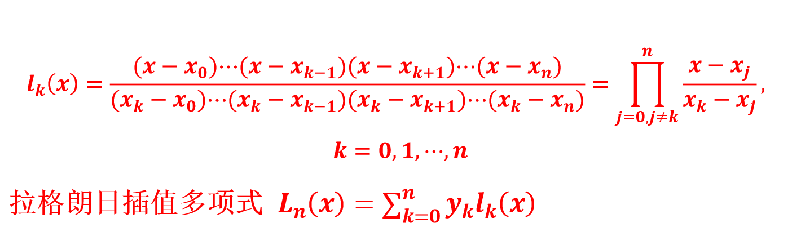

## 第一章 导论

数学关系的函数形式根据物理含义的多寡分为：经验模型、半经验模型、机理模型。

建模获得函数关系后，函数关系的利用方法之一便是进行材料优化设计，求性能最优的条件，与之相关的是优化问题。
对于优化，数学模型就是目标函数。只要数学模型确定，优化都是可行的。

优化算法分为局部优化算法和全局优化算法。
局部优化算法很多时候只能收敛到局部极小值，要收敛到全局最小点，较依赖于初始点的选择。
而全局优化算法，如粒子群算法、遗传算法、模拟退火算法等，是启发式算法，可适用于更复杂数学模型。

粒子群算法：模拟鸟集群飞行觅食的行为，鸟之间通过集体的协作找到食物最充沛的地方（最优解）。
遗传算法：通过模拟自然进化过程搜索最优解的方法，即“物竞天择，适者生存”。

数值分析的要求：数学模型的形式已知；全变量必须为数值型。

机器学习就是针对大量的实验数据，通过一定的算法习得数据的内在数学模型。
机器学习不仅可以处理数值型数据，还可以处理文本、图像等非数值型数据，是处理材料整体研究成果的重要数学手段。
机器学习属于人工智能的范畴，是一种以数据为中心的方法，目的是挖掘大数据背后隐藏的信息，可以理解为一种经验式地对输入（又称特征）和输出（又称标签）的关系进行抽象概括的手段。

第一个机器学习的定义来自于 Arthur Samuel，他定义机器学习为：在进行特定编程的情况下，给予计算机学习能力的领域。

Tom Mitchell 认为：一个好的学习问题定义如下，一个程序被认为能从经验 E 中学习，解决任务 T，达到性能度量值 P，当且仅当，有了经验 E 后，经过 P 评判，程序在处理 T 时的性能有所提升。
以下棋任务为例，经验 E 即程序上万次的自我练习的经验；任务 T 就是下棋；性能度量值 P 定义为它在与一些新的对手比赛时，赢得比赛的概率。

机器学习单纯面向数据，根据学习任务采用一定的算法，通过优化习得数学模型，可以预测其他新的数据。
机器学习过程可以看成是拟合与优化的集合，输出的是模型。
优化的目标函数不仅是已有数据与模型的误差，而是要考虑预测新数据的泛化性的损失函数。

学习任务包括回归和分类。
回归就是建立因素与连续变量特性的数学关系模型，常见算法包括决策树、极限梯度提升、支持向量机、人工神经网络等。
分类是建立依据各因素条件将数据样本分为有限个类别的数学模型，建立因素与有限个标签变量的数学关系模型。

机器学习可分为监督学习和无监督学习两大类。
监督学习是训练数据中有输出属性数据（或称标记数据）。
无监督学习是从没有输出属性数据的训练数据集中学习预测模型的机器学习问题。无监督学习是对数据本身特性的分析，主要包括聚类、降维、话题分析和图分析

---

## 第三章 Julia 语法基础

isodd:判断数值是否为奇数；iseven:判断数值是否为偶数
append!(odds, n):将元素 n 添加到列表 odds 末尾
return 直接结束整个方法，不管这个 return 处于多少层循环之内。而 break 用于完全结束一个循环，跳出循环体。
三维绘图函数mesh和surf的区别是：mesh重点突出网格线；surf重点突出曲面本身
ezplot函数：可以绘制显函数或隐函数的图像

---

## 第四章 插值

> 定理：满足插值条件 $P(x_i) = y_i, i = 0, 1, ..., n$ 的插值多项式 $P(x) = a_0 + a_1 x + ... + a_n x_n$ 存在且唯一。

#### 拉格朗日插值

对于一次插值，
插值基函数 $l_k(x) = x − x_{k+1} / x_k − x_{k+1}$, $l_{k+1}(x) = x − x_k / x_{k+1} − x_k$
满足条件 $l_k(x_k) = 1$, $l_k(x_{k+1}) = 0$; $l_{k+1}(x_k) = 0$, $l_{k+1}(x_{k+1}) = 1$
线性组合得到插值多项式：$L_1(x) = l_k(x) y_k + l_{k+1}(x) y_{k+1}$

对于二次插值，
令 $l_{k−1}(x) = A(x − x_k)(x − x_{k+1})$
由 $l_{k−1}(x_{k−1}) = 1$, $l_{k−1}(x_k) = l_{k−1}(x_{k+1}) = 0$
得到 $l_{k−1}(x) = (x − x_k)(x − x_{k+1}) / (x_{k−1} − x_k)(x_{k−1} − x_{k+1})$
类似地，计算出 $l_k(x)$ 和 $l_{k+1}(x)$，
再构造插值多项式 $L_2(x) = y_{k−1}l_{k−1}(x) + y_{k}l_{k}(x) + y_{k+1}l_{k+1}(x)$

与 n = 1, n = 2 的推导方式类似，可得拉格朗日插值通式：

拉格朗日插值 Julia 语法：`Using TyMath; yq = LagrangeInterp(x0, y0, xq)`

拉格朗日插值的优点：容易得到，公式紧凑；不足：当增删节点时，计算需重新进行。

#### 牛顿插值

