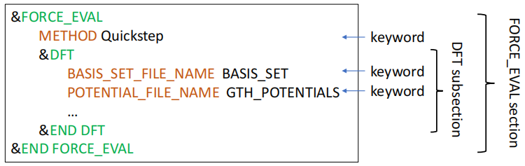

# CP2K_入门

CP2K 的输入文件一般命名为 `cp2k.inp`，其中关键词以 `section` 和 `subsection` 的形式，一环套一环，如下图所示。

<div align="left">

</div>

每一个 `section` 都是以 `&section` 开头，以 `&END section` 结尾，顺序随意，但是嵌套不能乱。
在 `section` 中，每行只写一个关键词，关键词后面接参数，CP2K 对大小写和空格不敏感。

常用的 `section` 包括 `GLOBAL`、`FORCE_EVAL`、`MOTION` 等，下面将逐个介绍它们。

---

## GLOBAL

`GLOBAL` 控制 CP2K 的全局参数，`GLOBAL` 的设置如下所示：
```
&GLOBAL
  PROJECT cp2k
  RUN_TYPE GEO_OPT
  PRINT_LEVEL LOW
&END GLOBAL 
```

`PROJECT` 指定计算任务名，个人习惯是统一设置成 `cp2k`，方便脚本后处理。

`RUN_TYPE` 指定 CP2K 计算任务的类型，包括
1. `MD`，分子动力学模拟；
2. `ENERGY`，单点能计算；
3. `ENERGY_FORCE`，计算能量和原子受力；
4. `GEO_OPT`，几何优化；
5. `CELL_OPT`，晶胞优化，常与 `GEO_OPT` 联用；
6. `BAND`，NEB计算；

`PRINT_LEVEL` 控制输出详略，一般设置成 `LOW` 或 `MEDIUM` 即可。

CP2K 中计算能量需要设置 `GLOBAL/RUN_TYPE` 为 `ENERGY`；
如果还要计算受力，需要设置 `GLOBAL/RUN_TYPE` 为 `ENERGY_FORCE`，
并设置 `FORCE_EVAL/PRINT/FORCES` 为 `ON`。
如果要将受力信息存储到文件中，则需要设定 `FROCE_EVAL/PRINT/FORCES/FILENAME` 文件名；
否则受力信息将会打印到 `*.out` 文件中。

注意，在 CP2K 中，默认的能量和距离单位分别是 `Hartree` (Hartree 原子单位) 和 `Bohr` (波尔半径)。
如果需要将它们转换成常用的 `eV`（电子伏特）和 `Å`（埃）单位，可以使用以下换算关系：
```
1 Hartree = 27.2114 eV
1 Bohr = 0.529177 Å
```
反之：
```
1 eV = 0.0367493 Hartree
1 Å = 1.88973 Bohr
```

---

## FORCE_EVAL

`FORCE_EVAL` 控制能量和原子受力（类似于 VASP 中的电子步），是 CP2K 中最重要的 `section`。
以 `SiSb` 的计算为例，一个典型的 `FORCE_EVAL`（使用 `DIAG` 算法）如下所示：
```
&FORCE_EVAL
  METHOD QUICKSTEP # FIST 是经典 MD，QUICKSTEP 是 AIMD；
  # STRESS_TENSOR ANALYTICAL # 对于晶胞体积/形状变化的计算需要打开这个参数；  
  &SUBSYS
    &CELL
	  # 下面两种指定晶胞参数的方法是等价的；
      A 18.62159700 0.000000000 0.000000000
      B 0.000000000 18.62159700 0.000000000
      C 0.000000000 0.000000000 18.62159700
      # ABC 18.62159700 18.62159700 18.62159700
      # ALPHA_BETA_GAMMA 90 90 90

      PERIODIC XYZ # 默认 XYZ，可选 X、Y、Z、XY、YZ、XZ、XYZ 和 NONE；
    &END CELL
    # &COORD # 指定原子坐标，更推荐使用下面的 TOPOLOGY 方法；
      # Si 0.000000000 0.000000000 0.000000000
      # Si 0.000000000 2.715348700 2.715348700
      # …
      # Sb 1.357674400 4.073023100 4.073023100
      # Sb 4.073023100 4.073023100 1.357674400
    # &END COORD
    &TOPOLOGY
      &CENTER_COORDINATES
  	  &END CENTER_COORDINATES
 	  COORD_FILE_NAME sisb.cif
  	  COORD_FILE_FORMAT CIF # 除了 cif，还可以读入 pdb、xtl，xyz 等格式；
    &END TOPOLOGY
    &KIND Sb
      ELEMENT Sb
      BASIS_SET TZVP-MOLOPT-SR-GTH-q5
      POTENTIAL GTH-PBE
    &END KIND
    &KIND Si
      ELEMENT Si
      BASIS_SET TZVP-MOLOPT-GTH-q4
      POTENTIAL GTH-PBE
    &END KIND
  &END SUBSYS
  &DFT
	@SET DATAPATH /home/changruiwang-ICME/Software/cp2k-2023.1/data
    BASIS_SET_FILE_NAME ${DATAPATH}/BASIS_MOLOPT # 基组文件 1；
    BASIS_SET_FILE_NAME ${DATAPATH}/BASIS_MOLOPT_UCL # 基组文件 2，相比 BASIS_MOLOPT，BASIS_MOLOPT_UCL 可选的元素种类更多；
    POTENTIAL_FILE_NAME ${DATAPATH}/POTENTIAL # 赝势文件；
    # WFN_RESTART_FILE_NAME cp2k-RESTART.wfn # 读取波函数；
    # CHARGE 0 # 体系整体电荷；
    # MULTIPLICITY 1 # 体系的整体自旋多重度；
    &QS
      EPS_DEFAULT 1.0E-14
      EXTRAPOLATION ASPC
      EXTRAPOLATION_ORDER 3
    &END QS
    &POISSON
      PERIODIC XYZ
 	  PSOLVER PERIODIC
    &END POISSON
    &XC
      &XC_FUNCTIONAL PBE # 控制泛函；
      &END XC_FUNCTIONAL
      &VDW_POTENTIAL # 控制色散校正；
        POTENTIAL_TYPE PAIR_POTENTIAL # 除了 PAIR_POTENTIAL 还有 NON_LOCAL（例如 RVV10）；
   	    &PAIR_POTENTIAL
   		  TYPE DFTD3(BJ)
          PARAMETER_FILE_NAME ${DATAPATH}/dftd3.dat
      	  REFERENCE_FUNCTIONAL PBE
		  R_CUTOFF 15 # 截断半径；
      	  # CALCULATE_C9_TERM T # C9 项，同时增加计算精度和计算量；
		  &PRINT_DFTD
	        FILENAME cp2k-dftd3.out
		  &END PRINT_DFTD
 	    &END PAIR_POTENTIAL
      &END VDW_POTENTIAL
    &END XC
    &MGRID
      NGRIDS 5 # 对 MOLOPT-GTH 基组，5 是最优设置；
      CUTOFF 400 # 取决于元素种类；
      REL_CUTOFF 60 # 默认 40，一般取 50 或 60；
      # USE_FINER_GRID T # 用于提高网格精细度；
    &END MGRID
    &SCF
      MAX_SCF 300 # SCF 迭代上限，类似于 VASP 中的 NELM；
      EPS_SCF 1.0E-6 # SCF 能量收敛标准，默认是 1E-5，单位是 hartree；
      SCF_GUESS RESTART
      &DIAGONALIZATION
        ALGORITHM STANDARD
        EPS_ADAPT 0.01
      &END DIAGONALIZATION
      &MIXING
        METHOD BROYDEN_MIXING
        ALPHA 0.4
        BETA 1.5
        NBROYDEN 8
      &END MIXING
      &SMEAR
        METHOD FERMI_DIRAC
  	    ELECTRONIC_TEMPERATURE 300
      &END SMEAR
      ADDED_MOS 500 # 求解一些额外的空轨道从而能被热激发的电子所占据；
      &PRINT
        &RESTART
          FILENAME cp2k-RESTART.wfn
   		  BACKUP_COPIES 0 
  	    &END RESTART
      &END PRINT
    &END SCF
    &PRINT
      &E_DENSITY_CUBE
        FILENAME cube
     	STRIDE 1 1 1 #Stride of exported cube file
   	  &END E_DENSITY_CUBE
    &END PRINT
  &END DFT
  &PRINT 
    &FORCES ON
      FILENAME cp2k-FORCE.dat
    &END FORCES 
  &END PRINT
&END FORCE_EVAL
```
CP2K 通常默认使用单 Gamma 点计算，需要使用足够大的晶胞以减少周期性误差。
如果晶胞太小，部分基组函数可能超出晶胞边界，导致重叠矩阵求逆过程出现数值问题，从而使得结果不可靠。
可以考虑增大晶胞尺寸或在输入文件中调整边界条件（如 `POISSON` 模块中的 `PERIODIC NONE`），
并适当提高平面波基组的截断能量（`CUTOFF`）和相对截断能量（`REL_CUTOFF`）。

切记，不能直接使用 VASP 中的小晶胞来进行 CP2K 的计算。
需要使用多 k 点时，可以在 `KPOINTS` 中指定网格的 k 点采样，如下所示：
```
&FORCE_EVAL
  &DFT
    &KPOINTS
      SCHEME MONKHORST-PACK 3 3 3
      SYMMETRY T
      VERBOSE T
      FULL_GRID T 
    &END KPOINTS
    ……
  &END DFT
&END FORCE_EVAL
```

CP2K 计算中需要指定赝势和基组文件（类似于 VASP 中的 `POTCAR`）。
赝势文件通常选择位于 `GTH_POTENTIALS` 目录下的 `PBE` 或 `BLYP` 泛函文件，并根据元素的价电子数选择不同的 `-q` 后缀，如 `-q4` 表示该赝势包含 4 个价电子。
基组文件常用 `BASIS_MOLOPT`，它经过专门的优化，适用于大部分元素体系；
而 `BASIS_MOLOPT_UCL` 是伦敦大学学院提供的扩展基组，适用于更多类型的元素。

在基组文件中，`SZV`（Single Zeta Valence）、`DZVP`（Double Zeta Valence with Polarization）、`TZVP`（Triple Zeta Valence with Polarization）分别代表基组的劈裂（多少层电子壳层）和极化函数的添加情况。
其中，`VP`（Valence Polarized）表示基组中包含极化函数。通常，劈裂层数和极化函数越多，计算结果越精确，但计算量也会显著增加。
计算量的顺序一般为：`SZV < DZVP < TZVP < TZV2P < TZV2PX`。

选择基组时应注意与赝势中的价电子数保持一致。
基组的大小对基组重叠误差（Basis Set Superposition Error, BSSE）有显著影响。
较大的基组（如 `TZVP` 或 `TZV2P`）通常可以有效降低 BSSE 误差，因此对于大体系或精度要求较高的计算，推荐使用 `DZVP` 或 `TZVP`。
在计算过程中，可以使用 COUNTERPOISE 方法来校正 BSSE 误差，确保结果的精度。

---

## FORCE_EVAL 中的 SCF 收敛算法

CP2K 提供了两种常用的 SCF（Self-Consistent Field）收敛算法：
1. 对角化算法（`DIAG`）：基于直接对角化的方式求解 KS（Kohn-Sham）方程。对于体系的带隙很小（如半导体或金属）或几乎没有（如金属体系），推荐使用 `DIAG` 算法，并开启电子展宽（`SMEAR`）来帮助收敛。

注意：在使用 `DIAG` 算法时，必须设置 `ADDED_MOS` 参数来指定额外的虚拟轨道数量，以防止出现电子填充不完全的问题，并提升收敛效果。
`ADDED_MOS` 的值通常需要设置为体系中价带电子数的 `5-10%` 左右，但对于金属体系或需要处理激发态的计算，可能需要更多的虚拟轨道以确保所有电子可以正确填充。

2. 轨道变换算法（`OT`）：一种基于轨道变换的 SCF 优化方法，通常比对角化算法更高效，尤其适用于具有较大带隙的绝缘体或介电材料体系。在体系中若带隙较大或者体系较为复杂时，`OT` 算法往往能显著加快 SCF 的收敛。

在使用 `DIAG` 或 `OT` 算法时，设置合适的混合参数（`MIXING`）是加速收敛的关键。
通常，对于金属体系（小带隙或无带隙），较低的混合参数（如 `MIXING 0.1`）可以避免 SCF 振荡；
而对于带隙较大的绝缘体，较高的混合参数（如 `MIXING 0.4`）则有助于加快收敛。

`DIAG` 算法的输入文件参考上一节。
`OT` 算法的 `.inp` 输入文件如下所示（只展示 `FORCE_EVAL/DFT` 下的 `SCF`），替换上一节中 `SCF` 即可：
```
    &SCF
      MAX_SCF 30
      EPS_SCF 1E-06
      SCF_GUESS RESTART
      &OT
	    ALGORITHM IRAC
        MINIMIZER CG
        LINESEARCH 3PNT
        PRECONDITIONER FULL_SINGLE_INVERSE
      &END OT
      &OUTER_SCF
        EPS_SCF 1.0E-05
        MAX_SCF 5
      &END OUTER_SCF
      &PRINT
        &RESTART OFF
          BACKUP_COPIES 0 
        &END RESTART
      &END PRINT
    &END SCF
```

`OT/MINIMIZER` 常用的设置有 `CG`、`DIIS` 以及 `BROYDEN`。
其中，`CG` 是最为稳定的算法，一般的计算任务都可以使用 `CG` 算法，并设置 `OT/LINESEARCH` 为比默认 `2PNT` 更贵但也更稳健的 `3PNT`。
`DIIS` 算法速度比较快，但没有 `CG` 稳定。
如果 `CG` 算法和 `DIIS` 算法收敛都有问题时，可以尝试使用 `BROYDEN` 算法。
采用 `OT` 时，推荐开启 `SCF/OUTER_SCF`，这是加速收敛的一种方法。
开启 `OUTER_SCF` 时 `SCF/MAX_SCF` 应当非常小，`15` 至 `35` 是比较合适的范围。
`OUTER_SCF` 迭代圈数通过 `SCF/OUTER_SCF/MAX_SCF` 控制，一般设为 `5` 即可。
实际 SCF 迭代次数上限等于 `SCF/MAX_SCF *（1+SCF/OUTER_SCF/MAX_SCF）`。
另外，`SCF/EPS_SCF` 设置的是 SCF 总的收敛标准（一般是 `1E-6` ），而 `SCF/OUTER_SCF/EPS_SCF` 设置的是 `OUTER_SCF` 的收敛标准（一般是 `1E-5`），后者绝对值应当大于或等于前者。
`OT/PRECONDITIONER` 中，`FULL_ALL` 通常最稳定，但耗时最长（`GAPW` 计算只能使用 `FULL_ALL` 另说）；
大体系可以尝试 `FULL_SINGLE_INVERSE` 和 `FULL_KINETIC`。
`OT/ALGORITHM` 可以从默认的 `STRICT` 改为 `IRAC`，SCF 收敛会更稳健。
但实际上，即使是对于非金属体系，有时候 `DIAG` 算法也可能比 `OT` 算法速度更快。
所以，在进行大规模的计算之前最好进行充分的测试。

---

## SCF 收敛相关

当 CP2K 计算出现 SCF（Self-Consistent Field）难以收敛的情况时，首先应检查体系结构的合理性，以确保没有出现原子位置不佳或结构畸变的问题。
以下是一些常用的收敛优化方法：

1. 增大 SCF 迭代次数：
如果 SCF 过程表现出一定的收敛趋势，但无法在当前迭代次数内收敛，可以通过增加 `SCF/MAX_SCF` 来允许更多的迭代次数继续计算，直至满足收敛标准。

2. 初猜波函数优化：
通常较小的基组（例如 `DZVP`）比大的基组（例如 `TZVP`）更容易收敛。
可以先用较小基组进行一次计算，并将其收敛的波函数保存下来，作为大基组计算的初始猜测波函数（initial guess），这将有助于提高 SCF 的收敛性。

3. 检查截断能设置：
DFT 计算中，`DFT/MGRID` 中的 `CUTOFF` 和 `REL_CUTOFF` 参数用于控制格点的精度。
若截断能量设置不够大，不仅会导致计算结果不准确，还会增加 SCF 的收敛难度。
通常建议将 `CUTOFF` 设置为 `400-600 Ry`，并将 `REL_CUTOFF` 设置为 `40-60 Ry`，根据实际体系进行适当调整。

4. 调整 SCF 混合策略（MIXING）：
设置 `SCF/MIXING/METHOD` 为 `BROYDEN_MIXING` 来控制 SCF 过程中旧密度矩阵与新密度矩阵的混合比例，有利于加快 SCF 的收敛速度。

- `ALPHA`：表示新密度矩阵混入旧密度矩阵的比例，默认为 0.4。当 SCF 难以收敛时，可尝试减小 `ALPHA` 值（如 0.1、0.2、0.3）以增加收敛稳定性。
- `NBROYDEN`：控制 Broyden 方法中使用的历史矩阵数量。默认值为 4，通常过小，可将其增大到 8 或 12 以提升收敛效果。

5. 电子温度控制：
对于金属体系或半导体体系，可以在 `SCF/SMEAR` 中设置 `METHOD` 为 `FERMI_DIRAC`，并适当增大 `ELECTRONIC_TEMPERATURE`（如 `300-1000 K`），可以帮助电子填充更平滑，从而加快收敛。

总结：SCF 收敛的难度通常与体系结构、基组选择、计算精度以及 SCF 迭代策略密切相关。可综合利用上述方法进行逐步优化，以达到更稳定的 SCF 收敛。

---

## MOTION

`MOTION` 控制原子/离子运动（类似于 VASP 中的离子步）。
无论是几何优化、晶胞优化、AIMD 还是过渡态搜索，都需要仔细地设置 `MOTION` 板块。

### 几何优化

使用 CP2K 进行几何优化时，需要设置 `GLOBAL/RUN_TYPE` 为 `GEO_OPT`。
CP2K 中几何优化分为两种，一种是正常的能量极小化优化，一种是使用 dimer 算法进行过渡态优化，默认前者。
能量极小化优化有三种算法，分别是 `CG`、`BFGS` 和 `LBFGS`。
`CG` 算法是最稳定的算法，但计算速度相对较慢；`BFGS` 算法效率最高也最常用，
计算中需要对 Hessian 矩阵进行对角化，如果初始结构不合理，`BFGS` 算法容易出问题；
`LBFGS` 算法效率和 `BFGS` 类似，同时稳定性也很好，适合超大体系。
对于一般的几何优化，推荐使用 `LBFGS` 算法。

注意，使用 dimer 进行过渡态优化时，只能使用 `CG` 算法。

几何优化（能量极小化）的 `MOTION` 如下所示：
```
&MOTION 
  &GEO_OPT 
    TYPE MINIMIZATION # 搜索过渡态时启用 TRANSITION_STATE ；
    MAX_ITER 200
    # MAX_DR 3.0E-3 # 最大位移；
    # RMS_DR 1.5E-3 # 根均方位移；
    MAX_FORCE 4.5E-4 # 最大受力，单位 a.u./bohr ，一般只调整这个即可；
    # RMS_FORCE 3.0E-4 # 均方根受力；
    # KEEP_SPACE_GROUP T
    # EPS_SYMMETRY 1.0E-4
    OPTIMIZER BFGS 
  &END GEO_OPT
  &CONSTRAINT 
    &FIXED_ATOMS 
 	  LIST 1 2 3 4 
 	  LIST 12..43  
 	&END FIXED_ATOMS 
  &END CONSTRAINT
  &PRINT
    &TRAJECTORY
      FORMAT xyz # 默认输出是不带有晶胞参数信息的 .xyz 文件
    &END TRAJECTORY
  &END PRINT
&END MOTION
```
如果在几何优化过程中需要固定部分原子，可以在 `MOTION/CONSTRAINT` 设置 `FIXED_ATOMS` 选项。
在几何优化过程中，有可能中途偶尔出现几步 SCF 不收敛。
此时 CP2K 程序还会继续算下去，只要最终几何优化收敛时 SCF 是收敛的状态就行了。
几何优化每一步输出的结构都写在 `cp2k-pos-1.xyz` 中，使用命令 `grep = cp2k-pos-1.xyz` 查看每一步的能量，使用命令 `grep Max\.\ g cp2k.out` 查看每一步的受力。

### 晶胞优化

晶胞优化是在几何结构优化的基础上，同时优化晶胞参数。
首先，`GLOBAL/RUN_TYPE` 设置为 `CELL_OPT`，然后在 `MOTION` 部分需要同时设置 `CELL_OPT` 和 `GEO_OPT` 的参数，
如下所示：
```
&MOTION 
  &CELL_OPT 
    TYPE GEO_OPT # DIRECT_CELL_OPT 是类似于VASP中的结构优化，GEO_OPT 是晶胞优化和几何优化交替进行；
    MAX_ITER 200 
    # MAX_DR 3.0E-3
    # RMS_DR 1.5E-3
    MAX_FORCE 6.0E-4
    # RMS_FORCE 3.0E-4
    # CONSTRAINT Z # 固定 Z 轴；
    # KEEP_ANGLES T # 是否固定晶格角度；
    # KEEP_SPACE_GROUP T # 是否固定空间群；
    # KEEP_SYMMETRY T # 是否固定对称性；
    # EXTERNAL_PRESSURE 1.0 0.0 0.0 0.0 1.0 0.0 0.0 0.0 1.0 # 设置外压；
    # PRESSURE_TOLERANCE 1.0E-2 # 晶胞优化中静水压的容忍限度；
    OPTIMIZER CG
    &CG 
      &LINE_SEARCH 
 	    TYPE 2PNT  
 	  &END LINE_SEARCH
    &END CG 
  &END CELL_OPT 
  &GEO_OPT 
    ……
  &END GEO_OPT 
  &CONSTRAINT 
    ……
  &END CONSTRAINT
  &PRINT
    ……
  &END PRINT
&END MOTION
```
此外，在 `FORCE_EVAL/STRESS_TENSOR` 需要设置为 `ANALYTICAL`。
使用命令 `grep CELL cp2k.out` 查看晶胞优化结果。

### AIMD

计算 AIMD 是 CP2K 的优势项目，特别是 CP2K 自带的 CSVR 热浴能更好地控温。
```
&MOTION
  &MD
    ENSEMBLE NVT
    TIMESTEP 2.0
    STEPS 10000
    TEMPERATURE 300
    &THERMOSTAT
      TYPE CSVR
      &CSVR
        TIMECON 200
      &END CSVR
    &END THERMOSTAT
  &END MD
  &CONSTRAINT 
    ……
  &END CONSTRAINT
  &PRINT
    &TRAJECTORY
      &EACH
        MD 1
      &END EACH
      FORMAT XYZ
    &END TRAJECTORY
    &CELL # 输出晶格参数信息，NPT 系综下非常有用；
    &END CELL
    &FORCES # 输出原子受力信息；
    &END FORCES
    &VELOCITIES
      &EACH
        MD   1
      &END EACH
    &END VELOCITIES
    &RESTART_HISTORY # 保存可用于 CP2K 重启 AIMD 的文件；
      &EACH
        MD  1000
      &END EACH
    &END RESTART_HISTORY
  &END PRINT
&END MOTION
```
CP2K 计算 AIMD 时，可以在 `FORCE_EVAL/DFT/SCF/PRINT` 中关掉波函数输出（即设置 `RESTART OFF`），避免I/O浪费时间。

在 VASP 和 LAMMPS 中可以设置初温与末温，而 CP2K 对于变温过程不是那么友好。
CP2K 变温的方式有两种，一种是准静态变温，另一种是使用 `ANNEALING` 参数控制变温。
准静态变温是将某一温度下平衡的结构输出，用于下一温度的模拟。
`ANNEALING` 参数是通过设置温度标度因子，每步使用该因子重新进行温度标度。
当 `ANNEALING > 1` 时为升温过程，反之为降温，其默认值为1。
使用该命令时不能使用热浴，这意味着仅可选择 NVE 或 NPE 系综。
一般操作是先在 NPT 或 NVT 系综下平衡结构，得到 `.restart` 文件后改为 NVE 系综通过 `ANNEALING` 参数变温，
运行的步数与你设置的标度因子有关，最后再使用 `.restart` 文件在 NPT 或 NVT 系综下平衡。

### NEB 过渡态搜索

准备初、末态的结构文件，分别使用 CP2K 进行固定晶格的结构优化（即 `GEO_OPT`）。
优化好的初态和末态分别命名为 `ini.xyz` 和 `fin.xyz`。
`GLOBAL/RUN_TYPE` 设置为 `BAND`，`FORCE_EVAL` 和前述基本一致，其中 `SUBSYS/TOPOLOGY` 的结构文件用 `ini.xyz` 即可。
然后在 `MOTION` 部分设置 `BAND` 参数，如下所示：
```
&MOTION
  &BAND
    K_SPRING 0.05 # 弹簧常数的值，默认 0.05 即可；
    BAND_TYPE CI-NEB 
    NUMBER_OF_REPLICA 5 # 初、末态间的插点数，一般不需要太多；
    NPROC_REP 24 # 每个插点使用的核心数； 
    ALIGN_FRAMES T # 是否控制插点排成直线；
    ROTATE_FRAMES T # 是否控制插点旋转；
    &CI_NEB
	  NSTEPS_IT  5
    &END CI_NEB
    &OPTIMIZE_BAND
	  OPTIMIZE_END_POINTS F # 不优化末态结构；
      OPT_TYPE DIIS
      &DIIS
        MAX_STEPS 250
	    MAX_STEPSIZE 2.0
      &END DIIS
    &END OPTIMIZE_BAND
    &CONVERGENCE_CONTROL # 收敛判据
      MAX_DR 0.002
      MAX_FORCE 0.003
      RMS_DR 0.005
      RMS_FORCE 0.005 
    &END CONVERGENCE_CONTROL
	&PROGRAM_RUN_INFO
	  INITIAL_CONFIGURATION_INFO F
    &END PROGRAM_RUN_INFO
	&CONVERGENCE_INFO
    &END CONVERGENCE_INFO
    &REPLICA # 结构文件，除了初态和末态之外，还可以自己提供中间态。
      COORD_FILE_NAME ini.xyz     
    &END REPLICA
    &REPLICA
      COORD_FILE_NAME fin.xyz    
    &END REPLICA
  &END BAND
  &PRINT
    &RESTART
      BACKUP_COPIES 0 #Maximum number of backing up restart file, 0 means never
    &END RESTART
  &END PRINT
&END MOTION
```
输出文件中，ener 文件输出 NEB 每步的能量和原子间距变化，
`-pos-Replica*.xyz` 文件输出各点的原子坐标优化过程。

---
