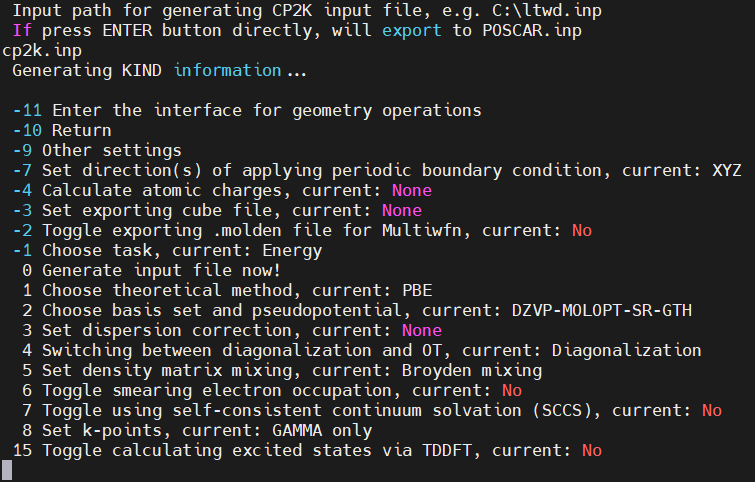

# 使用 Multiwfn 创建 CP2K 输入文件

## Multiwfn 的安装

访问 [Multiwfn 官网](http://sobereva.com/multiwfn) 下载 noGUI 版本的 `Multiwfn_3.8_dev_bin_Linux_noGUI.zip` 安装包并使用 `unzip` 命令解压。

在 `~/.bashrc` 加入以下命令：
```sh
ulimit -s unlimited
export OMP_STACKSIZE=200M
export Multiwfnpath=/home/changruiwang-ICME/Software/Multiwfn_3.8_dev_bin_Linux_noGUI
export PATH=/home/changruiwang-ICME/Software/Multiwfn_3.8_dev_bin_Linux_noGUI:${PATH}
```
最后，在 `Multiwfn_3.8_dev_bin_Linux_noGUI` 中增加可执行权限 `chmod u+x Multiwfn_noGUI` 即可。

---

## Multiwfn 创建 CP2K 输入文件

我们可以使用 Multiwfn 便捷地产生 CP2K 输入文件。

1. 首先 `./Multiwfn_noGUI`，并载入一个 Multiwfn 可以识别的至少含有结构信息的文件（例如 `.cif`、`.xyz` 等结构文件，但是最好不要直接使用 POSCAR）；
2. 然后在 Multiwfn 主菜单里输入 `cp2k`，并选择输入产生 CP2K 输入文件的路径（最好是命名为 `cp2k.inp`，方便提交）；
3. 通过 Multiwfn 子菜单提示的各种选项，设置如何进行 CP2K 相关计算；
4. 最后，选择选项 `0`（Generate input file now!）生成 CP2K 的输入文件 `cp2k.inp`；
5. 修改 `cp2k.inp` 得到符合实际计算要求的输入文件；

注意，尽管这种方法非常简便，也绝对不能把 CP2K 当黑箱用！！！

### Multiwfn 创建 CP2K 单点计算输入文件

以 GeTe（GeTe.cif 中共包含 8 个原子）为例。
下面展示如何使用 Multiwfn 产生一个最简单的输入文件，即使用 PBE 泛函结合 DZVP-MOLOPT-SR-GTH 基组做单点计算。

依次键入：
```
> Multiwfn_noGUI GeTe.cif
> cp2k
> cp2k.inp
```

程序返回如图所示的界面：

<div align="left">

</div>

下面逐步介绍菜单中的选项设置，一般需要修改的选项加粗提示：
- **`-1`**：选择任务类型，默认是 `Energy`，这里改为 **`Energy + force`**，同时计算体系能量和原子受力。
- `-7`：设置周期性边界条件，默认 `XYZ`；
- `-4`：控制是否计算原子电荷，默认是 `None`；
- `-3`：控制是否输出 `.cube` 电荷密度文件，默认是 `None`；
- `-2`：控制是否输出记录原子、基函数、轨道等信息的 `.molden` 波函数文件，默认是 `No`；
- **`1`**：选择泛函，默认 PBE 泛函；
- **`2`**：选择基组和赝势，默认 DZVP-MOLOPT-SR-GTH；
- **`3`**：选择色散校正类型，默认是 `None`；
- **`4`**：选择 Diag 或 OT 自洽迭代算法，OT 算法只能应用于单 Gamma 点计算，这里选择 Diag 算法；
- **`5`**：（如果选择 Diag 算法）选择密度矩阵混合算法，默认是 Broyden mixing，保持默认即可；
- **`5`**：（如果选择 OT 算法）控制是否使用 outer SCF，默认是 `Yes`，保持默认即可；
- **`6`**：（如果选择 Diag 算法）控制是否使用展宽，默认是 `No`，**建议开启**；
- `7`：控制是否使用溶剂化模型，默认是 `No`;
- **`8`**：设置 K 点，默认是仅使用 Gamma 点，这里参考 VASPKIT 中的 Accuracy Levels 0.03 对应的 K 点密度设置为 **`6 6 6`**；
- **`13`**：是否使用更严格的收敛标准，默认是 `No`，**建议开启**，即设置 `EPS_DEFAULT 1.0E-14` 和 `EPS_SCF 1.0E-07`；
- `15`：是否通过 TDDFT 计算激发态，默认是 `No`；

最后键入 **`-9`** 进入其他设置：
- `1`：修改体系净电荷，默认是 `0`；
- `2`：修改体系自旋多重度，默认是 `1`；
- `3`：设置孤立体系的重复单元数，默认是 `1 1 1`；
- `4`：控制是否使用更精细的网格，默认是 `No`；
- **`5`**：设置 CUTOFF 和 REL_CUTOFF，这两个参数极大地影响计算效率和计算精度，需要经过严格的测试，本例中保持默认；
- `6`：控制是否打印电偶极矩和磁矩，默认是 `No`；
- `8`：控制是否使用 DFT + U，默认是 `No`，本例不使用；
- `9`：设置原子磁矩初猜，对于有磁性的体系非常关键；
- `10`：控制输出详细程度，默认是 `Low`；
- `11`：设置外电场矢量；
- `12`：设置展宽方法中的虚拟轨道数量；
- `13`：是否将晶胞置于盒子中间，默认是 `No`；
- `14`：是否打印轨道能量和占据，默认是 `No`，按需开启；
- `18`：是否打印 EPR hyperfine coupling tensor，默认是 `No`，不太了解；
- `19`：控制是否使用 constrained DFT (CDFT)，不太了解；
- `20`：控制是否使用 LRIGPW 加速计算，默认是 `No`；
- `21`：控制是否使用 LSSCF 方法加速计算，默认是 `No`；
- `22`：设置泊松求解器类型，默认是 PERIODIC（适用于三维体系）；
- `23`：控制是否使用表面偶极校正，默认是 `None`，可以选择应用于 X、Y、Z 三个方向；
- **`30`**：控制是否通过结构文件读取原子坐标，默认是 `No`，**建议开启**；

键入 **`0`** 回到基本设置界面，再键入 **`0`** 生成单点计算相关的输入文件 `cp2k.inp`。

### Multiwfn 创建 CP2K 结构优化输入文件

以 GeTe（GeTe.cif 中共包含 216 个原子）为例。

- **`-1`**：选择任务类型，选择 **`Optimizing both structure and cell`**，同时优化原子位置和晶胞参数。
- `-7`：设置周期性边界条件，默认 `XYZ`；
- **`-5`**：选择输出文件格式，默认是 `pdb` 格式，**建议改为 `xyz` 格式**；
- `-4`：控制是否计算原子电荷，默认是 `None`；
- `-3`：控制是否输出 `.cube` 电荷密度文件，默认是 `None`；
- `-2`：控制是否输出记录原子、基函数、轨道等信息的 `.molden` 波函数文件，默认是 `No`；
- **`1`**：选择泛函，默认 PBE 泛函，这里选择 PBEsol 泛函，这是一种很适合计算固体的泛函；
- **`2`**：选择基组和赝势，默认 DZVP-MOLOPT-SR-GTH；
- **`3`**：选择色散校正类型，默认是 `None`；
- **`4`**：选择 Diag 或 OT 自洽迭代算法，OT 算法只能应用于单 Gamma 点计算，这里选择 Diag 算法；
- **`5`**：（如果选择 Diag 算法）选择密度矩阵混合算法，默认是 Broyden mixing，保持默认即可；
- **`5`**：（如果选择 OT 算法）控制是否使用 outer SCF，默认是 `Yes`，保持默认即可；
- **`6`**：（如果选择 Diag 算法）控制是否使用展宽，默认是 `No`，**建议开启**；
- `7`：控制是否使用溶剂化模型，默认是 `No`;
- **`8`**：设置 K 点，默认是仅使用 Gamma 点，这里保持默认即可；
- `9`：是否冻结原子位置，默认是 `None`；
- `10`: 选择 BFGS、LBFGS、CG 优化算法，默认是 `BFGS`，这里保持默认即可；
- `11`: 是否固定晶格参数，默认是 `None`；
- **`12`**: 设置外压，默认是 `1.01325E+00 bar`，这里改为 `isotropic external pressure; 0`；
- **`13`**：是否使用更严格的收敛标准，默认是 `No`；
- `15`：是否通过 TDDFT 计算激发态，默认是 `No`；

键入 **`-9`** 进入其他设置，参考上一节。

最后，键入 **`0`** 回到基本设置界面，再键入 **`0`** 生成结构优化计算相关的输入文件 `cp2k.inp`。

### Multiwfn 创建 CP2K AIMD 模拟输入文件

以 GeTe（GeTe.cif 中共包含 216 个原子）为例。

- **`-1`**：选择任务类型，选择 **`Molecular dynamics`**。
- `-7`：设置周期性边界条件，默认 `XYZ`；
- `-6`：控制输出轨迹的频率，默认是 `1`；
- **`-5`**：选择输出文件格式，默认是 `pdb` 格式，**建议改为 `xyz` 格式**；
- `-4`：控制是否计算原子电荷，默认是 `None`；
- `-3`：控制是否输出 `.cube` 电荷密度文件，默认是 `None`；
- `-2`：控制是否输出记录原子、基函数、轨道等信息的 `.molden` 波函数文件，默认是 `No`；
- **`1`**：选择泛函，默认 PBE 泛函，这里选择 PBEsol 泛函，这是一种很适合计算固体的泛函；
- **`2`**：选择基组和赝势，默认 DZVP-MOLOPT-SR-GTH；
- **`3`**：选择色散校正类型，默认是 `None`；
- **`4`**：选择 Diag 或 OT 自洽迭代算法，OT 算法只能应用于单 Gamma 点计算，这里选择 Diag 算法；
- **`5`**：（如果选择 Diag 算法）选择密度矩阵混合算法，默认是 Broyden mixing，保持默认即可；
- **`5`**：（如果选择 OT 算法）控制是否使用 outer SCF，默认是 `Yes`，保持默认即可；
- **`6`**：（如果选择 Diag 算法）控制是否使用展宽，默认是 `No`，**建议开启**；
- `7`：控制是否使用溶剂化模型，默认是 `No`;
- **`8`**：设置 K 点，默认是仅使用 Gamma 点，这里保持默认即可；
- `9`：是否冻结原子位置，默认是 `None`；
- **`10`**: 选择热浴，推荐 `Canonical sampling through velocity rescaling`；
- **`12`**: 设置压浴，默认是 `None`；
- **`13`**：是否使用更严格的收敛标准，默认是 `No`；
- `15`：是否通过 TDDFT 计算激发态，默认是 `No`；

键入 **`-9`** 进入其他设置，参考上一节。

最后，键入 **`0`** 回到基本设置界面，再键入 **`0`** 生成 AIMD 计算相关的输入文件 `cp2k.inp`。

---

在发表文章时提及输入文件是借助 Multiwfn 创建的并恰当引用 Multiwfn 程序原文，
是对 Multiwfn 这个功能继续开发最好的鼓励与支持。 