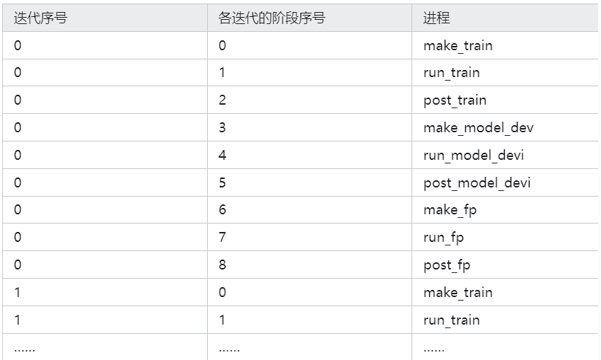
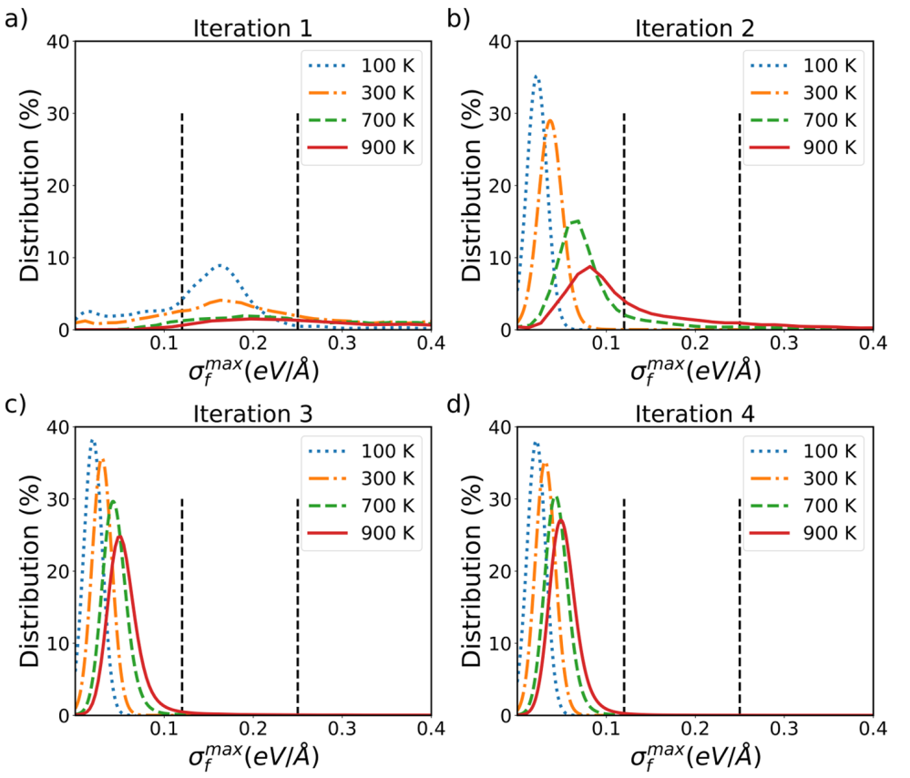

# DPGEN 入门

## DPGEN 在集群 3 的安装

DPGEN 的安装过程类似 DeePMD-kit 的安装，下载离线安装包后拖入集群并赋予可执行权限，键入命令`./dpgen-0.10.6-Linux-x86_64.sh` 即可。

安装完成后，使用命令 `conda activate dpgen` 加载环境。
如果找不到 `libffi.so.7`，`cd /home/changruiwang-ICME/Software/dpgen/lib` 目录，检查有没有 `libffi.so.7`。
如果没有，使用命令 `ln -s libffi.so.6 libffi.so.7` 创建一个链接即可。
注意，集群 3 由于 PBS 队列系统版本原因，需要 `vi dpgen/lib/python3.8/site-packages/dpdispatcher/pbs.py` 并修改下列变量为：

```python
pbs_script_header_dict['select_node_line'] = "#PBS -l nodes={number_node}:ppn={cpu_per_node}".format(number_node = resources.number_node, cpu_per_node = resources.cpu_per_node)
status_word = stdout.read().decode('utf-8').split('<job_state>')[-1].split('</job_state>')[0]
```

---

## DPGEN 的基本任务流程

DPGEN 的基本任务类型包括 init_bulk、init_surf、run、test 等。
使用命令 `dpgen -h` 查看 DPGEN 支持的任务类型，命令 `dpgen run -h` 查看某个具体任务类型的用法。
例如，使用命令 `nohup dpgen init_bulk param.json machine.json 1>log 2>err &` 可以在后台执行 init_bulk 任务；
使用命令 `nohup dpgen run param.json machine.json 1>log 2>err &` 可以在后台执行 run 任务。
根据 `nohup` 返回的进程号，使用命令 `ps -ux` 查看后台进程运行情况。

DPGEN 的关键参数文件是 `param.json` 和 `machine.json`。
`param.json` 告诉 DPGEN 执行什么样的计算任务；`machine.json` 告诉 DPGEN 在什么环境及什么机器上工作。
DPGEN 任务均在含有 `machine.json` 的主文件夹下进行。

<div align="left">

</div>

以最常用的 run 为例，由于每一次迭代都包括探索（见上图）、标记和训练三个步骤，相应地，`machine.json` 由 `train`、`model_devi` 和 `fp` 三个部分组成。
在 `machine.json` 文件中，每个部分都是一个字典，每个字典可以被视为独立的计算环境，如下所示：

```
{
"api_version": "1.0",
   	"deepmd_version": "2.2.7",
   	"train" : [{
     	"command": "/home/changruiwang-ICME/Software/deepmd-gpu/bin/dp",
      	"machine": {
         	"batch_type": "PBS",
           	"local_root" : "./",
          	"remote_root": "/home/changruiwang-ICME/dpgen_work/dpgen_run",
         	"context_type": "LocalContext"
    	},
     	"resources": {
          	"number_node": 1,
           	"cpu_per_node": 32,
         	"gpu_per_node": 2,
         	"queue_name": "gpu",
           	"group_size": 1,
          	"custom_flags": [
             	"#PBS -N deepmd",
               	"#PBS -l walltime=144:00:00",
               	"#PBS -S /bin/bash",
               	"#PBS -V"
        	],
         	"source_list": [
           		"/home/changruiwang-ICME/script/dpgen_source/dpmd.sh"
        	],
       		"envs": {
               	"CUDA_VISIBLE_DEVICES": "0,1",
             	"OMP_NUM_THREADS": "16"
         	}
  		}
}],
 	"model_devi": [{
     	"command": "/home/changruiwang-ICME/Software/deepmd-gpu/bin/lmp",
    	"machine": {
         	"batch_type": "PBS",
        	"local_root" : "./",
          	"remote_root": "/home/changruiwang-ICME/dpgen_work/dpgen_run",
        	"context_type": "LocalContext"
     	},
      	"resources": {
       		"number_node": 1,
          	"cpu_per_node": 32,
           	"gpu_per_node": 2,
           	"queue_name": "gpu",
        	"group_size": 8,
          	"custom_flags": [
              	"#PBS -N lammps",
               	"#PBS -l walltime=144:00:00",
             	"#PBS -S /bin/bash",
             	"#PBS -V"
          	],
         	"source_list": [
           		"/home/changruiwang-ICME/script/dpgen_source/lmp.sh"
 			],
          	"envs": {
             	"CUDA_VISIBLE_DEVICES": "0,1",
            	"OMP_NUM_THREADS": "8",
             	"LAMMPS_PLUGIN_PATH": "/home/changruiwang-ICME/Software/deepmd-gpu/lib/deepmd_lmp"
        	}
  		}
}],
  	"fp": [{
     	"command": "mpirun -np 24 /opt/software/vasp/vasp6.4.0/bin/vasp_gam",
     	"machine": {
        	"batch_type": "PBS",
         	"local_root" : "./",
       		"remote_root": "/home/changruiwang-ICME/dpgen_work/dpgen_run",
        	"context_type": "LocalContext"
     	},
    	"resources": {
         	"number_node": 1,
           	"cpu_per_node": 24,
         	"gpu_per_node": 0,
        	"queue_name": "manycores",
        	"group_size": 8,
        	"custom_flags": [
               	"#PBS -N vasp",
            	"#PBS -l walltime=600:00:00",
               	"#PBS -S /bin/bash",
              	"#PBS -V"
        	],
        	"source_list": [
              	"/home/changruiwang-ICME/script/dpgen_source/vasp.sh"
         	]
    	}
}]
}
```

与之搭配的 `param.json` 如下所示：

```
{
 	"type_map": ["Ge","Te"],
  	"mass_map": [72.64,127.6],
   	"init_data_prefix": "./",
   	"init_data_sys": ["train/Ge64Te64/"],
   	"sys_configs_prefix": "./",
   	"sys_configs": [
   		["init/perturb/*/POSCAR"],
     	["init/scale_0.96/*/POSCAR"],
      	["init/scale_1.04/*/POSCAR"]
 	],
  	"numb_models": 4,
  	"_training_init_frozen_model": [
     	["./init_model/000/frozen_model.pb"],
      	["./init_model/001/frozen_model.pb"],
      	["./init_model/002/frozen_model.pb"],
      	["./init_model/003/frozen_model.pb"]
  	],
  	"model_devi_activation_func": [
["tanh","tanh"],
["tanh","gelu"],
["gelu","tanh"],
["gelu","gelu"]
],
  	"default_training_param": {
      	"model": {
         	"type_map": ["Ge","Te"],
          	"descriptor": {
          		"type": "se_e2_a",
          		"sel": [100,100],
          		"rcut_smth": 2.0,
           		"rcut": 6.0,
           		"neuron": [25,50,100],
          		"resnet_dt": false,
          		"type_one_side": true,
         		"axis_neuron": 12,
           		"seed": 1
    		},
      		"fitting_net": {
          		"neuron": [240,240,240],
          		"resnet_dt": true,
          		"seed": 1
      		}
 		},
  		"learning_rate": {
     		"type": "exp",
     		"start_lr": 0.001,
      		"decay_steps": 4000
   		},
  		"loss": {
     		"start_pref_e": 0.02,
     		"limit_pref_e": 1,
       		"start_pref_f": 1000,
      		"limit_pref_f": 1,
      		"start_pref_v": 0.0,
       		"limit_pref_v": 0.0
  		},
  		"training": {
     		"stop_batch": 100000,
       		"disp_file": "lcurve.out",
      		"disp_freq": 2000,
       		"numb_test": 4,
      		"save_freq": 2000,
       		"save_ckpt": "model.ckpt",
      		"disp_training": true,
       		"time_training": true,
     		"profiling": false,
   			"profiling_file": "timeline.json"
  		}
},
"model_devi_engine": "lammps",
"model_devi_dt": 0.002,
"model_devi_skip": 0,
"model_devi_f_trust_lo": 0.05,
"model_devi_f_trust_hi": 0.15,
"model_devi_clean_traj": 1,
"model_devi_jobs": [
  		{"sys_idx": [0],"temps": [300, 450, 600, 750, 900],"press": [1.0, 100.0], "trj_freq":   5, "nsteps":   1000, "ensemble": "npt", "_idx":     "00" },
  		{"sys_idx": [1],"temps": [300, 450, 600, 750, 900],"press": [1.0, 100.0], "trj_freq":   5, "nsteps":   1000, "ensemble": "npt", "_idx":     "01" },
  		{"sys_idx": [2],"temps": [300, 450, 600, 750, 900],"press": [1.0, 100.0], "trj_freq":   5, "nsteps":   1000, "ensemble": "npt", "_idx":     "02" },
  		{"sys_idx": [0],"temps": [300, 450, 600, 750, 900],"press": [1.0, 100.0], "trj_freq":  50, "nsteps":  10000, "ensemble": "npt", "_idx":     "03" },
 		{"sys_idx": [1],"temps": [300, 450, 600, 750, 900],"press": [1.0, 100.0], "trj_freq":  50, "nsteps":  10000, "ensemble": "npt", "_idx":     "04" },
  		{"sys_idx": [2],"temps": [300, 450, 600, 750, 900],"press": [1.0, 100.0], "trj_freq":  50, "nsteps":  10000, "ensemble": "npt", "_idx":     "05" },
  		{"sys_idx": [0],"temps": [300, 450, 600, 750, 900],"press": [1.0, 100.0], "trj_freq": 500, "nsteps": 100000, "ensemble": "npt", "_idx":     "06" },
      	{"sys_idx": [1],"temps": [300, 450, 600, 750, 900],"press": [1.0, 100.0], "trj_freq": 500, "nsteps": 100000, "ensemble": "npt", "_idx":     "07" },
      	{"sys_idx": [2],"temps": [300, 450, 600, 750, 900],"press": [1.0, 100.0], "trj_freq": 500, "nsteps": 100000, "ensemble": "npt", "_idx":     "08" }
  	],
   	"fp_style": "vasp",
  	"fp_pp_path": "./",
   	"fp_pp_files": ["POTCAR_Ge","POTCAR_Te"],
  	"fp_incar": "./INCAR",
  	"fp_accurate_threshold": 0.999,
  	"fp_accurate_soft_threshold": 0.99,
   	"shuffle_poscar": false,
  	"fp_task_max": 50,
  	"fp_task_min": 3,
   	"ratio_failed": 0.05
}
```

当 `param.json` 的关键词 `model_devi_jobs` 下有 `template` 参数时，`model_devi` 步骤使用指定的 `lmp/input.lammps` 为模板，如下所示：

```
"model_devi_jobs":  [{
  	"sys_idx": [0],"traj_freq": 10,"_idx": "00",
      	"template":{"lmp": "lmp/input.lammps"},
       	"rev_mat":{
"lmp": {"V_NSTEPS": [20000], "V_TEMP": [300], "V_PRES": [1]},
          	"plm": {"V_TEMP":  [300], "V_STRIDE": [10]}
      	}}, …… ]
```

需要注意 `input.lammps` 中 `dump` 行需要修改为 `dump dpgen_dump`。
使用模板时 DPGEN 会调用 `revise_lmp_input_dump` 函数来写 `input.lammps` 里的 `trj_freq`，而不是像一般情况下在文件开头定义 `DUMP_FREQ` 再调用。

我们可以将 run 主流程的执行过程分解为如下 9 步：

<div align="left">

</div>

假设最后一个迭代的候选构型数小于 `fp_task_min` 时，那该轮迭代实际上并没有进行新的 `00.train/`，而是软链接到前一轮迭代的 `00.train/`。
如果任务异常退出需要重启，删除 `record.dpgen` 最后一行并重新键入前述命令即可。

同理 VASP 计算，DPGEN 也需要进行 `ENCUT` 和 `KSPACING` 的收敛测试。
通过 MP 下载的晶体结构，可以先做晶胞微扰后再测试，目的是增大原子受力区分度。
收敛标准是以渐进收敛线（或最高精度值）为参考，取相对波动小于一定范围的参数。
一般而言，`ENCUT` 和 `KSPACING` 收敛测试的相对能量偏差小于 `1E-3 eV/atom`，
力和位力偏差小于 `1E-2 eV/Angstrom` 和 `1E-2 eV/atom` 即可。
此外，DPGEN 还需要通过测试来确定两个关键参数 `model_devi_f_trust_lo` 和 `model_devi_f_trust_hi` 的取值。
具体的做法是先做一轮 run 迭代，模拟中采样构型的模型力偏差可以在 `iter.00000*/01.model_devi/task*/model_devi.out` 查看。
在 `01.model_devi/` 使用脚本 `dpgen_max_devi_f_distribution.sh` 可以获取不同温度下的力偏差文件 `Max_Devi_F`，做频率分布图如下所示：

<div align="left">

</div>

图（a）中最大偏差力分布的峰值在 `0.15 eV/Angstrom` 左右。
一则说明该训练模型没有收敛，精度不够；二则说明力偏差判据下、上界取 `0.15` 和 `0.35` 是比较合适的。
另一种经验做法是，判据的下界略高于训练误差，而上界则在此基础上再增加 `0.1~0.3 eV/Angstrom` 左右。

---

## 训练集收集

DPGEN 迭代生成的训练集是分散储存的，使用 `collect` 函数进行数据收集。
首先可以使用 `dpgen collect -h` 查看 `collect` 函数使用说明。
一般键入命令 `dpgen collect JOB_DIR OUTPUT_DIR -p param.json` 即可。
其中 `JOB_DIR` 是 DPGEN 的输出目录，包含 `iter.0000*` 等；`OUTPUT_DIR` 是目标文件夹。
例如：

```
dpgen collect ./ ./collect -p param.json
```

上述命令会把当前文件夹下的数据收集到 `collect` 目录里。
`collect` 目录中，`init.*` 是初始训练集，`sys.*` 是 DPGEN 生成的训练集（按照 `param.json` 中的 `sys` 分类）。
最后，使用命令 `python dp2xyz.py collect/sys.000/` 即可将 DP 数据转成 `.xyz` 格式。
