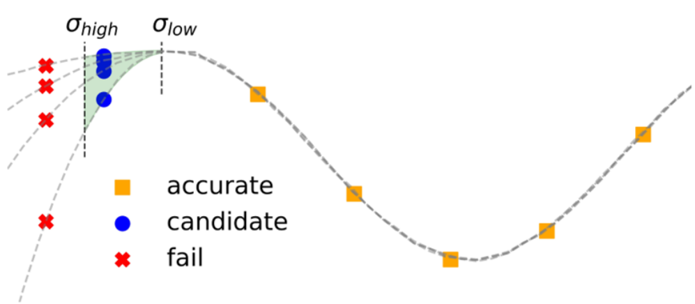
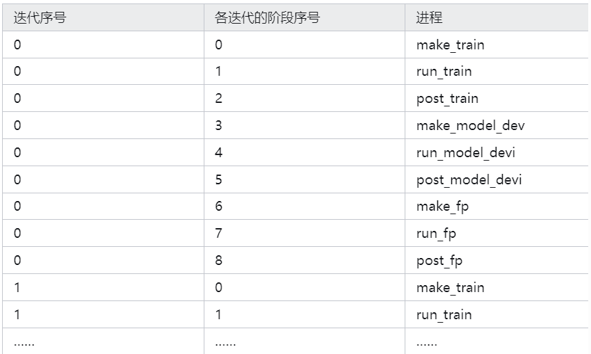
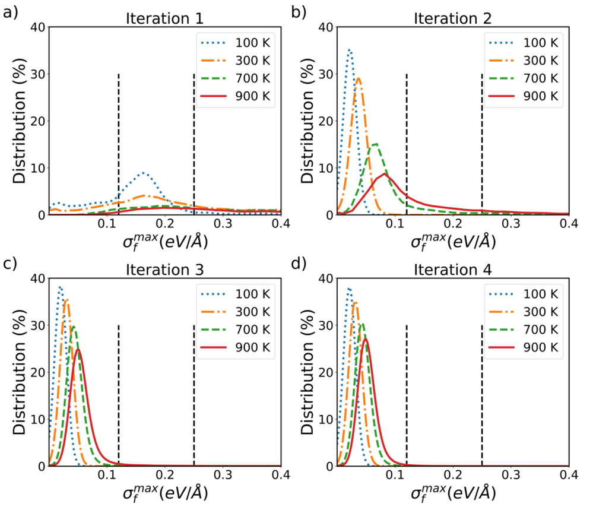

# DeePMD-kit入门教程

## 一、数据准备

有了 VASP 静态计算数据后，可以使用 `python vasp_to_xyz.py` 将其转化成 `.xyz` 格式。
使用 `python xyz2dp.py` 可以将 `.xyz` 格式转化成 `.npy` 格式的 DP 训练集；
反之，使用 `python dp2xyz.py` 可以将 DP 训练集转化成 NEP 训练集。

### DP训练集的目录结构

DP训练集的目录结构如下：

```
.
└── Ge64Te64
    ├── set.000
    │   ├── box.npy
    │   ├── coord.npy
    │   ├── energy.npy
    │   ├── force.npy
    │   └── virial.npy
    ├── type_map.raw
    └── type.raw
```

- **set.000**: 一个目录，包含压缩格式的数据；
  - `box.npy`: 储存系统的盒子信息；
  - `coord.npy`: 储存原子的坐标；
  - `energy.npy`: 储存系统的能量；
  - `force.npy`: 储存原子所受的力；
  - `virial.npy`: 储存系统的应力张量；
- **type_map.raw**: 将整数类型映射到原子名称；
- **type.raw**: 包含原子整数类型的信息；


DP 按系统分类，例如上面的 `Ge64Te64` 就是一个系统。
系统内的所有构型都具有相同的原子类型和原子序号，因此只需为整个系统指定一次原子类型信息即可。

### 文件转换工具

以下是文件转换工具的详细使用说明：

- `vasp_to_xyz.py`：将 VASP 数据转化为 `.xyz` 格式。使用方法：
  ```bash
  python vasp_to_xyz.py input_file output_file
  ```
  `input_file` 为 VASP 数据文件，`output_file` 为生成的 `.xyz` 格式文件。

- `xyz2dp.py`：将 `.xyz` 格式的 NEP 训练集转化为 `.npy` 格式的 DP 训练集。使用方法：
  ```bash
  python xyz2dp.py input_file output_dir
  ```
  `input_file` 为 `.xyz` 格式的训练集文件，`output_dir` 为生成的 DP 训练集目录。

- `dp2xyz.py`：将 DP 训练集转化为 NEP 训练集。使用方法：
  ```bash
  python dp2xyz.py input_dir output_file
  ```
  `input_dir` 为 DP 训练集目录，`output_file` 为生成的 `.xyz` 格式文件。

通过以上步骤，你可以将不同格式的训练集进行互相转换，并根据需求进行训练数据的准备。

---

## 二、势函数训练

数据准备完成后，就可以进行 DP 势函数的训练，首先需要准备训练脚本 `input.json`，如下所示：

```json
{
    "model": {
        "type_map": ["Ge", "Te"],
        "descriptor": {
            "type": "se_e2_a",
            "rcut": 6.00,
            "rcut_smth": 0.50,
            "sel": [80, 80],
            "neuron": [25, 50, 100],
            "resnet_dt": false,
            "axis_neuron": 16,
            "seed": 1
        },
        "fitting_net": {
            "neuron": [240, 240, 240],
            "resnet_dt": true,
            "seed": 1
        }
    },
    "learning_rate": {
        "type": "exp",
        "decay_steps": 5000,
        "start_lr": 0.001,
        "stop_lr": 3.51e-8
    },
    "loss": {
        "type": "ener",
        "start_pref_e": 0.02,
        "limit_pref_e": 1,
        "start_pref_f": 1000,
        "limit_pref_f": 1,
        "start_pref_v": 0,
        "limit_pref_v": 0
    },
    "training": {
        "training_data": {
            "systems": ["./train/Ge64Te64/"],
            "batch_size": "auto"
        },
        "validation_data": {
            "systems": ["./test/Ge64Ge64/"],
            "batch_size": 1,
            "numb_btch": 3
        },
        "numb_steps": 500000,
        "seed": 10,
        "disp_file": "lcurve.out",
        "disp_freq": 1000,
        "save_freq": 10000
    }
}
```

同样的训练参数可以适配不同的系统，所以我们一般只需要微调 `input.json` 即可。
设置 `input.json` 中的 `sel` 时，可以使用 `dp neighbor-stat -s train -r 8.0 -t Ge Te` 查看系统近邻数。
本例中，结果显示截断半径为 8 埃时，Ge、Te 的近邻原子数分别是 68、68。
考虑到 MD 模拟过程中可能存在一些极端几何形状，`sel` 应设置为比训练数据集更高的值，例如 `[80, 80]`。

准备好输入文件后，使用 `qsub rundeepmd.pbs` 提交任务开始训练。
`rundeepmd.pbs` 脚本如下所示：

```bash
#PBS -N deepmd
#PBS -l nodes=1:ppn=32
#PBS -l walltime=144:00:00
#PBS -q gpu
#PBS -S /bin/bash
#PBS -V
export INTEL_MPI_HOME=/opt/intel2020/compilers_and_libraries_2020.1.217/linux/mpi
export PATH=$INTEL_MPI_HOME/intel64/bin:$PATH
export MANPATH=$INTEL_MPI_HOME/man:$MANPATH
export LD_LIBRARY_PATH=$INTEL_MPI_HOME/intel64/lib:$LD_LIBRARY_PATH
NP=`cat $PBS_NODEFILE | wc -l`
NN=`cat $PBS_NODEFILE | sort | uniq | tee /tmp/nodes.$$ | wc -l`
cat $PBS_NODEFILE > /tmp/nodefile.$$
cd $PBS_O_WORKDIR
ulimit -s unlimited
export CUDA_VISIBLE_DEVICES=0,1
export OMP_NUM_THREADS=8
source activate /home/changruiwang-ICME/Software/deepmd-gpu
EXEC=/home/changruiwang-ICME/Software/deepmd-gpu/bin/dp
mpirun -machinefile $PBS_NODEFILE -np $NP $EXEC train input.json > output
```

如果一切正常，将在屏幕上看到每 1000 步打印一次的信息，并每隔 10000 步将模型保存在检查点文件 `model.ckpt` 中。
我们可以通过观察输出文件 `lcurve.out` 来观察训练阶段误差的情况，其中第四列和第五列是能量的训练和测试误差，第六列和第七列是力的训练和测试误差。
使用 `dploss.py` 脚本可以对该文件进行可视化。

训练过程异常停止时，我们可以从检查点重新开始训练。
修改提交脚本中 `$EXEC train input.json > output` 为 `$EXEC train --restart model.ckpt input.json > output` 即可。

训练结束时，需要使用命令 `dp freeze -o graph.pb` 冻结模型参数为一个 `.pb` 文件，通过 `-o` 参数指定模型文件名。
压缩模型能将 DPMD 的模拟速度再提高一个数量级，并且消耗更少的内存。
可以使用命令 `dp compress -i graph.pb -o graph-compress.pb` 压缩 `graph.pb`。

如果准备了验证集，可以使用命令 `dp test -m graph-compress.pb -s ./valid/Ge64Ge64/ -n 40 -d results` 检查训练模型的质量，它将在当前目录中输出名为 `results.e.out` 和 `results.f.out` 的文件。

---

## 训练集可视化

可以使用 chemiscope 可视化训练集中的原子局域环境。
以 GeTe 训练集为例，首先使用命令 `python dp2ase.py train/ Ge Te` 生成 `ase_dataset.db` 文件。
然后 `python dp_descriptors.py graph.pb ase_dataset.db Ge Te -a` 生成 `descriptors.npy` 和 `energies.npy` 文件。
最后 `python create_chemiscope_input.py -a 8 ase_dataset.db descriptors.npy energies.npy` 生成 `chemiscope.json.gz`（`-a` 后面的 8 是截断半径）压缩包。
将 `chemiscope.json.gz` 上传到 [网址](https://chemiscope.org/) 即可可视化训练集分布。

---

## 势函数用于分子动力学模拟

使用 LAMMPS 运行 DPMD 所需的输入文件包括初始结构文件 `coord.lmp`、模型文件 `graph-compress.pb`、输入文件 `lammps.in` 和提交脚本 `rundeepmd.pbs`。
下面以 Sb 相变模拟为例加以说明，输入文件 `lammps.in` 如下：

```plaintext
units       		metal
boundary      	p p p
atom_style     	atomic
neighbor       	2.0 bin
neigh_modify   	every 10 delay 0 check no
read_data      	coord.lmp
mass         	1 121.76000000
pair_style    		deepmd ./graph.pb
pair_coeff    	* *
variable       	run1   	equal  	60000
variable       	run2    	equal   	60000
variable       	run3    	equal   	140000
variable       	run4    	equal   	60000
variable       	run5    	equal   	180000
variable       	run6    	equal   	1000000
variable       	temp1  	equal  	2000.0
variable       	temp2 	equal  	1000.0
variable       	temp3 	equal  	300.0
variable        	temp4 	equal  	600.0
variable        	dt     	equal  	5.0e-4
variable        	tau    	equal  	${dt}*100
variable        	showt  	equal  	1000

velocity        	all create ${temp1} 12345
dump         	1 all custom ${showt} lammps.dump id type x y z

fix             	1 all nvt temp ${temp1} ${temp1} ${tau}
timestep        	${dt}
thermo_style    	custom step pe ke etotal temp press vol
thermo        	${showt}
run           	${run1}
write_restart  	nvt1.restart
unfix           	1

fix             	2 all nvt temp ${temp2} ${temp2} ${tau}
timestep        	${dt}
thermo_style    	custom step pe ke etotal temp press vol
thermo        	${showt}
run            	${run2}
write_restart   	nvt2.restart
unfix           	2

fix             	3 all nvt temp ${temp2} ${temp3} ${tau}
timestep        	${dt}
thermo_style    	custom step pe ke etotal temp press vol
thermo        	${showt}
run           	${run3}
write_restart   	nvt3.restart
unfix           	3

fix             	4 all nvt temp ${temp3} ${temp3} ${tau}
timestep        	${dt}
thermo_style    	custom step pe ke etotal temp press vol
thermo        	${showt}
restart         	5000 amorphous.restart
run            	${run4}
write_restart   	nvt4.restart
unfix           	4

fix             	5 all nvt temp ${temp3} ${temp4} ${tau}
timestep       	${dt}
thermo_style    	custom step pe ke etotal temp press vol
thermo        	${showt}
run            	${run5}
write_restart   	nvt5.restart
unfix           	5

fix             	6 all nvt temp ${temp4} ${temp4} ${tau}
timestep        	${dt}
thermo_style    	custom step pe ke etotal temp press vol
thermo       	${showt}
restart         	20000 smc.restart
run            	${run6}
write_restart   	nvt6.restart
unfix           	6
```

`qsub rundeepmd.pbs` 提交脚本即可运行 MLMD 模拟。
注意修改 `rundeepmd.pbs` 最后两行为：
```
export LAMMPS_PLUGIN_PATH=/home/changruiwang-ICME/Software/deepmd-gpu/lib/deepmd_lmp
EXEC=/home/changruiwang-ICME/Software/deepmd-gpu/bin/lmp
mpirun -machinefile $PBS_NODEFILE -np $NP $EXEC -in *.in > output
```

模拟过程中势能随时间的变化曲线如下图所示：

<div align="left">

</div>

---

## DPGEN 在集群 3 的安装

DPGEN 的安装过程类似 DeePMD-kit 的安装，下载离线安装包后拖入集群并赋予可执行权限，键入命令`./dpgen-0.10.6-Linux-x86_64.sh` 即可。

安装完成后，使用命令 `conda activate dpgen` 加载环境。
如果找不到 `libffi.so.7`，`cd /home/changruiwang-ICME/Software/dpgen/lib` 目录，检查有没有 `libffi.so.7`。
如果没有，使用命令 `ln -s libffi.so.6 libffi.so.7` 创建一个链接即可。
注意，集群 3 由于 PBS 队列系统版本原因，需要 `vi dpgen/lib/python3.8/site-packages/dpdispatcher/pbs.py` 并修改下列变量为：

```python
pbs_script_header_dict['select_node_line'] = "#PBS -l nodes={number_node}:ppn={cpu_per_node}".format(number_node = resources.number_node, cpu_per_node = resources.cpu_per_node)
status_word = stdout.read().decode('utf-8').split('<job_state>')[-1].split('</job_state>')[0]
```

---

## DPGEN 的基本任务流程

DPGEN 的基本任务类型包括 init_bulk、init_surf、run、test 等。
使用命令 `dpgen -h` 查看 DPGEN 支持的任务类型，命令 `dpgen run -h` 查看某个具体任务类型的用法。
例如，使用命令 `nohup dpgen init_bulk param.json machine.json 1>log 2>err &` 可以在后台执行 init_bulk 任务；
使用命令 `nohup dpgen run param.json machine.json 1>log 2>err &` 可以在后台执行 run 任务。
根据 `nohup` 返回的进程号，使用命令 `ps -ux` 查看后台进程运行情况。

DPGEN 的关键参数文件是 `param.json` 和 `machine.json`。
`param.json` 告诉 DPGEN 执行什么样的计算任务；`machine.json` 告诉 DPGEN 在什么环境及什么机器上工作。
DPGEN 任务均在含有 `machine.json` 的主文件夹下进行。

<div align="left">

</div>

以最常用的 run 为例，由于每一次迭代都包括探索（见上图）、标记和训练三个步骤，相应地，`machine.json` 由 `train`、`model_devi` 和 `fp` 三个部分组成。
在 `machine.json` 文件中，每个部分都是一个字典，每个字典可以被视为独立的计算环境，如下所示：

```
{
"api_version": "1.0",
   	"deepmd_version": "2.2.7",
   	"train" : [{
     	"command": "/home/changruiwang-ICME/Software/deepmd-gpu/bin/dp",
      	"machine": {
         	"batch_type": "PBS",
           	"local_root" : "./",
          	"remote_root": "/home/changruiwang-ICME/dpgen_work/dpgen_run",
         	"context_type": "LocalContext"
    	},
     	"resources": {
          	"number_node": 1,
           	"cpu_per_node": 32,
         	"gpu_per_node": 2,
         	"queue_name": "gpu",
           	"group_size": 1,
          	"custom_flags": [
             	"#PBS -N deepmd",
               	"#PBS -l walltime=144:00:00",
               	"#PBS -S /bin/bash",
               	"#PBS -V"
        	],
         	"source_list": [
           		"/home/changruiwang-ICME/script/dpgen_source/dpmd.sh"
        	],
       		"envs": {
               	"CUDA_VISIBLE_DEVICES": "0,1",
             	"OMP_NUM_THREADS": "16"
         	}
  		}
}],
 	"model_devi": [{
     	"command": "/home/changruiwang-ICME/Software/deepmd-gpu/bin/lmp",
    	"machine": {
         	"batch_type": "PBS",
        	"local_root" : "./",
          	"remote_root": "/home/changruiwang-ICME/dpgen_work/dpgen_run",
        	"context_type": "LocalContext"
     	},
      	"resources": {
       		"number_node": 1,
          	"cpu_per_node": 32,
           	"gpu_per_node": 2,
           	"queue_name": "gpu",
        	"group_size": 8,
          	"custom_flags": [
              	"#PBS -N lammps",
               	"#PBS -l walltime=144:00:00",
             	"#PBS -S /bin/bash",
             	"#PBS -V"
          	],
         	"source_list": [
           		"/home/changruiwang-ICME/script/dpgen_source/lmp.sh"
 			],
          	"envs": {
             	"CUDA_VISIBLE_DEVICES": "0,1",
            	"OMP_NUM_THREADS": "8",
             	"LAMMPS_PLUGIN_PATH": "/home/changruiwang-ICME/Software/deepmd-gpu/lib/deepmd_lmp"
        	}
  		}
}],
  	"fp": [{
     	"command": "mpirun -np 24 /opt/software/vasp/vasp6.4.0/bin/vasp_gam",
     	"machine": {
        	"batch_type": "PBS",
         	"local_root" : "./",
       		"remote_root": "/home/changruiwang-ICME/dpgen_work/dpgen_run",
        	"context_type": "LocalContext"
     	},
    	"resources": {
         	"number_node": 1,
           	"cpu_per_node": 24,
         	"gpu_per_node": 0,
        	"queue_name": "manycores",
        	"group_size": 8,
        	"custom_flags": [
               	"#PBS -N vasp",
            	"#PBS -l walltime=600:00:00",
               	"#PBS -S /bin/bash",
              	"#PBS -V"
        	],
        	"source_list": [
              	"/home/changruiwang-ICME/script/dpgen_source/vasp.sh"
         	]
    	}
}]
}
```

与之搭配的 `param.json` 如下所示：

```
{
 	"type_map": ["Ge","Te"],
  	"mass_map": [72.64,127.6],
   	"init_data_prefix": "./",
   	"init_data_sys": ["train/Ge64Te64/"],
   	"sys_configs_prefix": "./",
   	"sys_configs": [
   		["init/perturb/*/POSCAR"],
     	["init/scale_0.96/*/POSCAR"],
      	["init/scale_1.04/*/POSCAR"]
 	],
  	"numb_models": 4,
  	"_training_init_frozen_model": [
     	["./init_model/000/frozen_model.pb"],
      	["./init_model/001/frozen_model.pb"],
      	["./init_model/002/frozen_model.pb"],
      	["./init_model/003/frozen_model.pb"]
  	],
  	"model_devi_activation_func": [
["tanh","tanh"],
["tanh","gelu"],
["gelu","tanh"],
["gelu","gelu"]
],
  	"default_training_param": {
      	"model": {
         	"type_map": ["Ge","Te"],
          	"descriptor": {
          		"type": "se_e2_a",
          		"sel": [100,100],
          		"rcut_smth": 2.0,
           		"rcut": 6.0,
           		"neuron": [25,50,100],
          		"resnet_dt": false,
          		"type_one_side": true,
         		"axis_neuron": 12,
           		"seed": 1
    		},
      		"fitting_net": {
          		"neuron": [240,240,240],
          		"resnet_dt": true,
          		"seed": 1
      		}
 		},
  		"learning_rate": {
     		"type": "exp",
     		"start_lr": 0.001,
      		"decay_steps": 4000
   		},
  		"loss": {
     		"start_pref_e": 0.02,
     		"limit_pref_e": 1,
       		"start_pref_f": 1000,
      		"limit_pref_f": 1,
      		"start_pref_v": 0.0,
       		"limit_pref_v": 0.0
  		},
  		"training": {
     		"stop_batch": 100000,
       		"disp_file": "lcurve.out",
      		"disp_freq": 2000,
       		"numb_test": 4,
      		"save_freq": 2000,
       		"save_ckpt": "model.ckpt",
      		"disp_training": true,
       		"time_training": true,
     		"profiling": false,
   			"profiling_file": "timeline.json"
  		}
},
"model_devi_engine": "lammps",
"model_devi_dt": 0.002,
"model_devi_skip": 0,
"model_devi_f_trust_lo": 0.05,
"model_devi_f_trust_hi": 0.15,
"model_devi_clean_traj": 1,
"model_devi_jobs": [
  		{"sys_idx": [0],"temps": [300, 450, 600, 750, 900],"press": [1.0, 100.0], "trj_freq":   5, "nsteps":   1000, "ensemble": "npt", "_idx":     "00" },
  		{"sys_idx": [1],"temps": [300, 450, 600, 750, 900],"press": [1.0, 100.0], "trj_freq":   5, "nsteps":   1000, "ensemble": "npt", "_idx":     "01" },
  		{"sys_idx": [2],"temps": [300, 450, 600, 750, 900],"press": [1.0, 100.0], "trj_freq":   5, "nsteps":   1000, "ensemble": "npt", "_idx":     "02" },
  		{"sys_idx": [0],"temps": [300, 450, 600, 750, 900],"press": [1.0, 100.0], "trj_freq":  50, "nsteps":  10000, "ensemble": "npt", "_idx":     "03" },
 		{"sys_idx": [1],"temps": [300, 450, 600, 750, 900],"press": [1.0, 100.0], "trj_freq":  50, "nsteps":  10000, "ensemble": "npt", "_idx":     "04" },
  		{"sys_idx": [2],"temps": [300, 450, 600, 750, 900],"press": [1.0, 100.0], "trj_freq":  50, "nsteps":  10000, "ensemble": "npt", "_idx":     "05" },
  		{"sys_idx": [0],"temps": [300, 450, 600, 750, 900],"press": [1.0, 100.0], "trj_freq": 500, "nsteps": 100000, "ensemble": "npt", "_idx":     "06" },
      	{"sys_idx": [1],"temps": [300, 450, 600, 750, 900],"press": [1.0, 100.0], "trj_freq": 500, "nsteps": 100000, "ensemble": "npt", "_idx":     "07" },
      	{"sys_idx": [2],"temps": [300, 450, 600, 750, 900],"press": [1.0, 100.0], "trj_freq": 500, "nsteps": 100000, "ensemble": "npt", "_idx":     "08" }
  	],
   	"fp_style": "vasp",
  	"fp_pp_path": "./",
   	"fp_pp_files": ["POTCAR_Ge","POTCAR_Te"],
  	"fp_incar": "./INCAR",
  	"fp_accurate_threshold": 0.999,
  	"fp_accurate_soft_threshold": 0.99,
   	"shuffle_poscar": false,
  	"fp_task_max": 50,
  	"fp_task_min": 3,
   	"ratio_failed": 0.05
}
```

当 `param.json` 的关键词 `model_devi_jobs` 下有 `template` 参数时，`model_devi` 步骤使用指定的 `lmp/input.lammps` 为模板，如下所示：

```
"model_devi_jobs":  [{
  	"sys_idx": [0],"traj_freq": 10,"_idx": "00",
      	"template":{"lmp": "lmp/input.lammps"},
       	"rev_mat":{
"lmp": {"V_NSTEPS": [20000], "V_TEMP": [300], "V_PRES": [1]},
          	"plm": {"V_TEMP":  [300], "V_STRIDE": [10]}
      	}}, …… ]
```

需要注意 `input.lammps` 中 `dump` 行需要修改为 `dump dpgen_dump`。
使用模板时 DPGEN 会调用 `revise_lmp_input_dump` 函数来写 `input.lammps` 里的 `trj_freq`，而不是像一般情况下在文件开头定义 `DUMP_FREQ` 再调用。

我们可以将 run 主流程的执行过程分解为如下 9 步：

<div align="left">

</div>

假设最后一个迭代的候选构型数小于 `fp_task_min` 时，那该轮迭代实际上并没有进行新的 `00.train/`，而是软链接到前一轮迭代的 `00.train/`。
如果任务异常退出需要重启，删除 `record.dpgen` 最后一行并重新键入前述命令即可。

同理 VASP 计算，DPGEN 也需要进行 `ENCUT` 和 `KSPACING` 的收敛测试。
通过 MP 下载的晶体结构，可以先做晶胞微扰后再测试，目的是增大原子受力区分度。
收敛标准是以渐进收敛线（或最高精度值）为参考，取相对波动小于一定范围的参数。
一般而言，`ENCUT` 和 `KSPACING` 收敛测试的相对能量偏差小于 `1E-3 eV/atom`，
力和位力偏差小于 `1E-2 eV/Angstrom` 和 `1E-2 eV/atom` 即可。
此外，DPGEN 还需要通过测试来确定两个关键参数 `model_devi_f_trust_lo` 和 `model_devi_f_trust_hi` 的取值。
具体的做法是先做一轮 run 迭代，模拟中采样构型的模型力偏差可以在 `iter.00000*/01.model_devi/task*/model_devi.out` 查看。
在 `01.model_devi/` 使用脚本 `dpgen_max_devi_f_distribution.sh` 可以获取不同温度下的力偏差文件 `Max_Devi_F`，做频率分布图如下所示：

<div align="left">

</div>

图（a）中最大偏差力分布的峰值在 `0.15 eV/Angstrom` 左右。
一则说明该训练模型没有收敛，精度不够；二则说明力偏差判据下、上界取 `0.15` 和 `0.35` 是比较合适的。
另一种经验做法是，判据的下界略高于训练误差，而上界则在此基础上再增加 `0.1~0.3 eV/Angstrom` 左右。

---

## 训练集收集

DPGEN 迭代生成的训练集是分散储存的，使用 `collect` 函数进行数据收集。
首先可以使用 `dpgen collect -h` 查看 `collect` 函数使用说明。
一般键入命令 `dpgen collect JOB_DIR OUTPUT_DIR -p param.json` 即可。
其中 `JOB_DIR` 是 DPGEN 的输出目录，包含 `iter.0000*` 等；`OUTPUT_DIR` 是目标文件夹。
例如：

```
dpgen collect ./ ./collect -p param.json
```

上述命令会把当前文件夹下的数据收集到 `collect` 目录里。
`collect` 目录中，`init.*` 是初始训练集，`sys.*` 是 DPGEN 生成的训练集（按照 `param.json` 中的 `sys` 分类）。
最后，使用命令 `python dp2xyz.py collect/sys.000/` 即可将 DP 数据转成 `.xyz` 格式。
