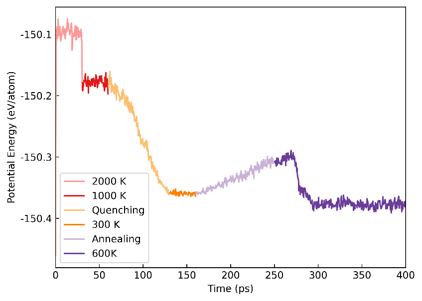

# DeePMD-kit 入门

## 一、数据准备

有了 VASP 静态计算数据后，可以使用 `python vasp_to_xyz.py` 将其转化成 `.xyz` 格式。
使用 `python xyz2dp.py` 可以将 `.xyz` 格式转化成 `.npy` 格式的 DP 训练集；
反之，使用 `python dp2xyz.py` 可以将 DP 训练集转化成 NEP 训练集。

### DP训练集的目录结构

DP训练集的目录结构如下：

```
.
└── Ge64Te64
    ├── set.000
    │   ├── box.npy
    │   ├── coord.npy
    │   ├── energy.npy
    │   ├── force.npy
    │   └── virial.npy
    ├── type_map.raw
    └── type.raw
```

- **set.000**: 一个目录，包含压缩格式的数据；
  - `box.npy`: 储存系统的盒子信息；
  - `coord.npy`: 储存原子的坐标；
  - `energy.npy`: 储存系统的能量；
  - `force.npy`: 储存原子所受的力；
  - `virial.npy`: 储存系统的应力张量；
- **type_map.raw**: 将整数类型映射到原子名称；
- **type.raw**: 包含原子整数类型的信息；


DP 按系统分类，例如上面的 `Ge64Te64` 就是一个系统。
系统内的所有构型都具有相同的原子类型和原子序号，因此只需为整个系统指定一次原子类型信息即可。

### 文件转换工具

以下是文件转换工具的详细使用说明：

- `vasp_to_xyz.py`：将 VASP 数据转化为 `.xyz` 格式。使用方法：
  ```bash
  python vasp_to_xyz.py input_file output_file
  ```
  `input_file` 为 VASP 数据文件，`output_file` 为生成的 `.xyz` 格式文件。

- `xyz2dp.py`：将 `.xyz` 格式的 NEP 训练集转化为 `.npy` 格式的 DP 训练集。使用方法：
  ```bash
  python xyz2dp.py input_file output_dir
  ```
  `input_file` 为 `.xyz` 格式的训练集文件，`output_dir` 为生成的 DP 训练集目录。

- `dp2xyz.py`：将 DP 训练集转化为 NEP 训练集。使用方法：
  ```bash
  python dp2xyz.py input_dir output_file
  ```
  `input_dir` 为 DP 训练集目录，`output_file` 为生成的 `.xyz` 格式文件。

通过以上步骤，你可以将不同格式的训练集进行互相转换，并根据需求进行训练数据的准备。

---

## 二、势函数训练

数据准备完成后，就可以进行 DP 势函数的训练，首先需要准备训练脚本 `input.json`，如下所示：

```json
{
    "model": {
        "type_map": ["Ge", "Te"],
        "descriptor": {
            "type": "se_e2_a",
            "rcut": 6.00,
            "rcut_smth": 0.50,
            "sel": [80, 80],
            "neuron": [25, 50, 100],
            "resnet_dt": false,
            "axis_neuron": 16,
            "seed": 1
        },
        "fitting_net": {
            "neuron": [240, 240, 240],
            "resnet_dt": true,
            "seed": 1
        }
    },
    "learning_rate": {
        "type": "exp",
        "decay_steps": 5000,
        "start_lr": 0.001,
        "stop_lr": 3.51e-8
    },
    "loss": {
        "type": "ener",
        "start_pref_e": 0.02,
        "limit_pref_e": 1,
        "start_pref_f": 1000,
        "limit_pref_f": 1,
        "start_pref_v": 0,
        "limit_pref_v": 0
    },
    "training": {
        "training_data": {
            "systems": ["./train/Ge64Te64/"],
            "batch_size": "auto"
        },
        "validation_data": {
            "systems": ["./test/Ge64Ge64/"],
            "batch_size": 1,
            "numb_btch": 3
        },
        "numb_steps": 500000,
        "seed": 10,
        "disp_file": "lcurve.out",
        "disp_freq": 1000,
        "save_freq": 10000
    }
}
```

同样的训练参数可以适配不同的系统，所以我们一般只需要微调 `input.json` 即可。
设置 `input.json` 中的 `sel` 时，可以使用 `dp neighbor-stat -s train -r 8.0 -t Ge Te` 查看系统近邻数。
本例中，结果显示截断半径为 8 埃时，Ge、Te 的近邻原子数分别是 68、68。
考虑到 MD 模拟过程中可能存在一些极端几何形状，`sel` 应设置为比训练数据集更高的值，例如 `[80, 80]`。

准备好输入文件后，使用 `qsub rundeepmd.pbs` 提交任务开始训练。
`rundeepmd.pbs` 脚本如下所示：

```bash
#PBS -N deepmd
#PBS -l nodes=1:ppn=32
#PBS -l walltime=144:00:00
#PBS -q gpu
#PBS -S /bin/bash
#PBS -V
export INTEL_MPI_HOME=/opt/intel2020/compilers_and_libraries_2020.1.217/linux/mpi
export PATH=$INTEL_MPI_HOME/intel64/bin:$PATH
export MANPATH=$INTEL_MPI_HOME/man:$MANPATH
export LD_LIBRARY_PATH=$INTEL_MPI_HOME/intel64/lib:$LD_LIBRARY_PATH
NP=`cat $PBS_NODEFILE | wc -l`
NN=`cat $PBS_NODEFILE | sort | uniq | tee /tmp/nodes.$$ | wc -l`
cat $PBS_NODEFILE > /tmp/nodefile.$$
cd $PBS_O_WORKDIR
ulimit -s unlimited
export CUDA_VISIBLE_DEVICES=0,1
export OMP_NUM_THREADS=8
source activate /home/changruiwang-ICME/Software/deepmd-gpu
EXEC=/home/changruiwang-ICME/Software/deepmd-gpu/bin/dp
mpirun -machinefile $PBS_NODEFILE -np $NP $EXEC train input.json > output
```

如果一切正常，将在屏幕上看到每 1000 步打印一次的信息，并每隔 10000 步将模型保存在检查点文件 `model.ckpt` 中。
我们可以通过观察输出文件 `lcurve.out` 来观察训练阶段误差的情况，其中第四列和第五列是能量的训练和测试误差，第六列和第七列是力的训练和测试误差。
使用 `dploss.py` 脚本可以对该文件进行可视化。

训练过程异常停止时，我们可以从检查点重新开始训练。
修改提交脚本中 `$EXEC train input.json > output` 为 `$EXEC train --restart model.ckpt input.json > output` 即可。

训练中需要使用预训练模型时，可以在 `$EXEC train input.json ` 后面增加 `--finetune ../pretrain_model/model.pt` 选项，表示在模型 `../pretrain_model/model.pt` 的基础上微调。

训练结束时，需要使用命令 `dp freeze -o graph.pb` 冻结模型参数为一个 `.pb` 文件，通过 `-o` 参数指定模型文件名。
压缩模型能将 DPMD 的模拟速度再提高一个数量级，并且消耗更少的内存。
可以使用命令 `dp compress -i graph.pb -o graph-compress.pb` 压缩 `graph.pb`。

如果准备了验证集，可以使用命令 `dp test -m graph-compress.pb -s ./valid/Ge64Ge64/ -n 40 -d results` 检查训练模型的质量，它将在当前目录中输出名为 `results.e.out` 和 `results.f.out` 的文件。

---

## 训练集可视化

可以使用 chemiscope 可视化训练集中的原子局域环境。
以 GeTe 训练集为例，首先使用命令 `python dp2ase.py train/ Ge Te` 生成 `ase_dataset.db` 文件。
然后 `python dp_descriptors.py graph.pb ase_dataset.db Ge Te -a` 生成 `descriptors.npy` 和 `energies.npy` 文件。
最后 `python create_chemiscope_input.py -a 8 ase_dataset.db descriptors.npy energies.npy` 生成 `chemiscope.json.gz`（`-a` 后面的 8 是截断半径）压缩包。
将 `chemiscope.json.gz` 上传到 [网址](https://chemiscope.org/) 即可可视化训练集分布。

---

## 势函数用于分子动力学模拟

使用 LAMMPS 运行 DPMD 所需的输入文件包括初始结构文件 `coord.lmp`、模型文件 `graph-compress.pb`、输入文件 `lammps.in` 和提交脚本 `rundeepmd.pbs`。
下面以 Sb 相变模拟为例加以说明，输入文件 `lammps.in` 如下：

```plaintext
units       		metal
boundary      	p p p
atom_style     	atomic
neighbor       	2.0 bin
neigh_modify   	every 10 delay 0 check no
read_data      	coord.lmp
mass         	1 121.76000000
pair_style    		deepmd ./graph.pb
pair_coeff    	* *
variable       	run1   	equal  	60000
variable       	run2    	equal   	60000
variable       	run3    	equal   	140000
variable       	run4    	equal   	60000
variable       	run5    	equal   	180000
variable       	run6    	equal   	1000000
variable       	temp1  	equal  	2000.0
variable       	temp2 	equal  	1000.0
variable       	temp3 	equal  	300.0
variable        	temp4 	equal  	600.0
variable        	dt     	equal  	5.0e-4
variable        	tau    	equal  	${dt}*100
variable        	showt  	equal  	1000

velocity        	all create ${temp1} 12345
dump         	1 all custom ${showt} lammps.dump id type x y z

fix             	1 all nvt temp ${temp1} ${temp1} ${tau}
timestep        	${dt}
thermo_style    	custom step pe ke etotal temp press vol
thermo        	${showt}
run           	${run1}
write_restart  	nvt1.restart
unfix           	1

fix             	2 all nvt temp ${temp2} ${temp2} ${tau}
timestep        	${dt}
thermo_style    	custom step pe ke etotal temp press vol
thermo        	${showt}
run            	${run2}
write_restart   	nvt2.restart
unfix           	2

fix             	3 all nvt temp ${temp2} ${temp3} ${tau}
timestep        	${dt}
thermo_style    	custom step pe ke etotal temp press vol
thermo        	${showt}
run           	${run3}
write_restart   	nvt3.restart
unfix           	3

fix             	4 all nvt temp ${temp3} ${temp3} ${tau}
timestep        	${dt}
thermo_style    	custom step pe ke etotal temp press vol
thermo        	${showt}
restart         	5000 amorphous.restart
run            	${run4}
write_restart   	nvt4.restart
unfix           	4

fix             	5 all nvt temp ${temp3} ${temp4} ${tau}
timestep       	${dt}
thermo_style    	custom step pe ke etotal temp press vol
thermo        	${showt}
run            	${run5}
write_restart   	nvt5.restart
unfix           	5

fix             	6 all nvt temp ${temp4} ${temp4} ${tau}
timestep        	${dt}
thermo_style    	custom step pe ke etotal temp press vol
thermo       	${showt}
restart         	20000 smc.restart
run            	${run6}
write_restart   	nvt6.restart
unfix           	6
```

`qsub rundeepmd.pbs` 提交脚本即可运行 MLMD 模拟。
注意修改 `rundeepmd.pbs` 最后两行为：
```
export LAMMPS_PLUGIN_PATH=/home/changruiwang-ICME/Software/deepmd-gpu/lib/deepmd_lmp
EXEC=/home/changruiwang-ICME/Software/deepmd-gpu/bin/lmp
mpirun -machinefile $PBS_NODEFILE -np $NP $EXEC -in *.in > output
```

模拟过程中势能随时间的变化曲线如下图所示：

<div align="left">

</div>
