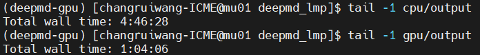
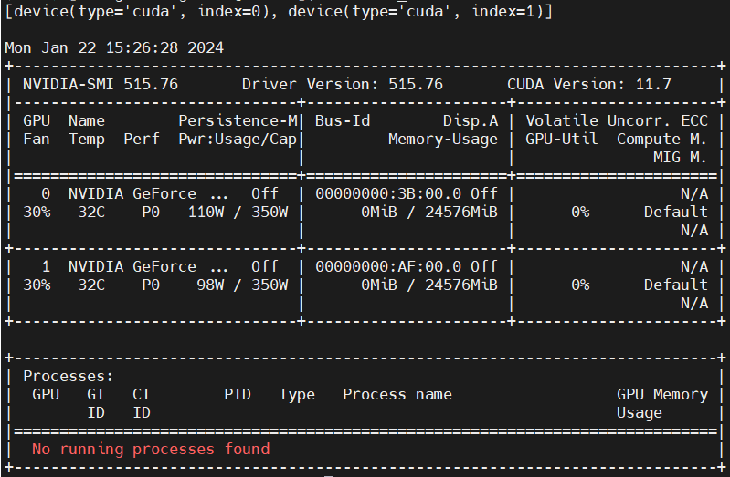

# DeePMD-kit 安装

建议注释掉 `~/.bashrc` 里面关于 conda 的初始化设置，以免被 DeePMD-kit 安装脚本给覆盖，安装结束后记得恢复即可。

访问 [官网](https://github.com/deepmodeling/deepmd-kit/releases) 下载离线安装脚本 `deepmd-kit-2.2.7-cpu-Linux-x86_64.sh`，拖入集群。
首先 `chmod 777 deepmd-kit-2.2.7-cpu-Linux-x86_64.sh` 增加脚本的可执行权限。
然后 `./deepmd-kit-2.2.7-cpu-Linux-x86_64.sh` 开始安装，一路根据提示操作即可。

需要注意的是，最后一步
```
Do you wish to update your shell profile to automatically initialize conda?
```
时一定选择 `no`。

安装完成后，使用命令
```
conda activate /home/changruiwang-ICME/Software/deepmd-kit
```
激活环境。

或者，创建一个软链接
```
ln -s /home/changruiwang-ICME/Software/deepmd-kit ~/anaconda3/envs/deepmd
```
这样就可以使用命令 `conda activate deepmd` 激活环境了。

最好是在 GPU 节点（`ssh gpu04`）上安装 DeePMD-kit。
下图是 DP 自带的 lmp 在集群 3 的 CPU 节点和 GPU 节点模拟同一条轨迹的耗时：

<div align="left">

</div>

由于集群 3 里 cu60 后续节点（包括 gpu04）没有 module 的封装，所以 INTEL_MPI 环境需要自己导入，如下所示：

```
export INTEL_MPI_HOME=/opt/intel2020/compilers_and_libraries_2020.1.217/linux/mpi
export PATH=$INTEL_MPI_HOME/intel64/bin:$PATH
export MANPATH=$INTEL_MPI_HOME/man:$MANPATH
export LD_LIBRARY_PATH=$INTEL_MPI_HOME/intel64/lib:$LD_LIBRARY_PATH
```

注意，集群 3 的 CUDA 版本是 11.7，使用 `nvidia-smi` 查看 NVIDIA 驱动信息，如下所示：

<div align="left">

</div>