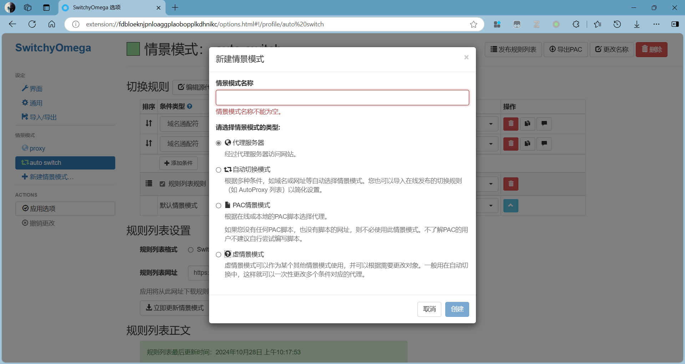
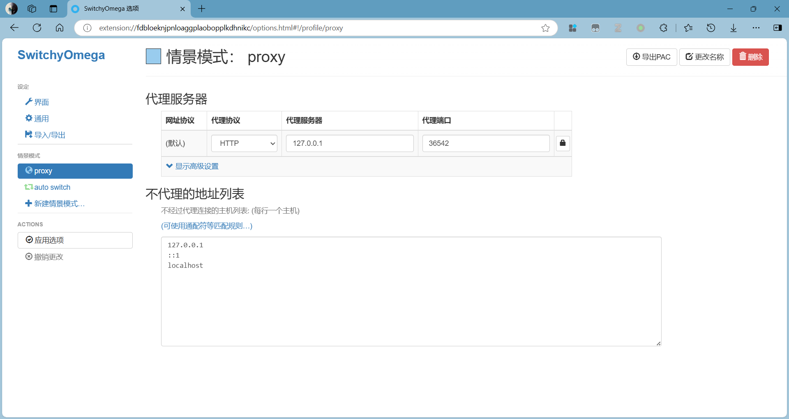
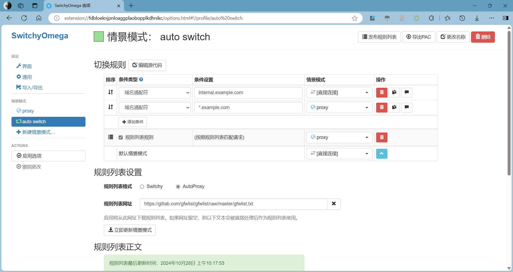
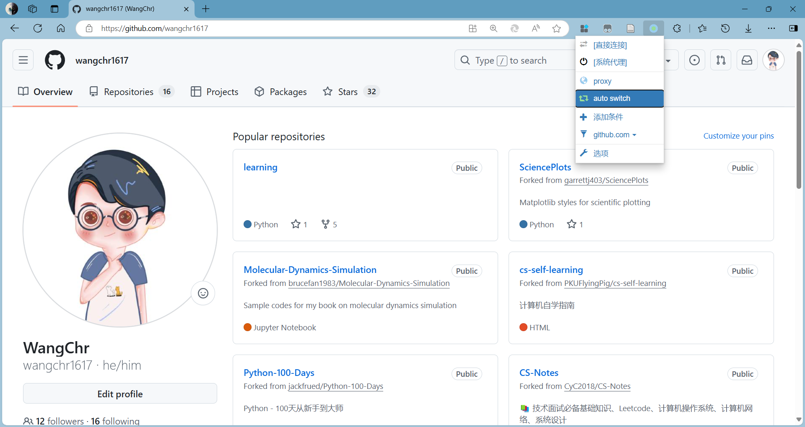

# SwitchOmega 使用教程

## 应用场景

首先，在使用插件之前，你需要一个代理服务器，并且已经通过某个代理客户端实现了科学上网。

不安装插件时，浏览器的代理取决于系统的默认代理；安装插件后，浏览器的代理取决于插件的设置。

使用 SwitchyOmega 插件来配置代理后，访问需要通过全局模式访问的网站时会自动切换成通过代理服务器访问；其余网站则不通过代理服务器来访问。
SwitchyOmega 插件避免了频繁手动切换代理模式的烦恼。

---

## 下载安装

SwitchyOmega 插件可以在 Chrome 应用商店在线安装。
如果无法在线安装，访问 [SwitchyOmega 官网](https://github.com/FelisCatus/SwitchyOmega/releases) 下载版本号后标记为 Latest 的版本。
然后在 Chrome 地址栏输入 `chrome://extensions` 打开扩展程序，拖动下载的 `.crx` 安装文件到扩展程序中进行离线安装。

目前 SwitchyOmega 支持 Chrome 和 Firefox 浏览器，插件只帮助管理代理 IP，不提供代理 IP 服务器，所以需要配合节点才可以使用，节点即插件中的代理服务器。
代理客户端一般默认的代理服务器地址就是 `127.0.0.1` 并且相关代理协议及端口如下，少数的代理客户端生成的代理协议的代理端口可能不一样。
- HTTP: 1080
- HTTPS: 443
- SOCKS4: 1080
- SOCKS5: 1080

---

## 配置教程

SwitchyOmega 情景模式一共有四种，分别是`代理服务器`、`自动切换模式`、`PAC情景模式`以及`虚情景模式`，新建情景模式的时候有这四种情景模式可选。

我们主要配置 `代理服务器(proxy)` 和 `自动切换模式(auto switch)` 即可。

### 代理服务器

`代理服务器` 指经过代理服务器访问网站。

我们需要根据本地安装的科学上网客户端设置 `代理服务器地址` 和 `代理端口`，如图所示：

### 自动切换模式

`自动切换模式` 指根据域名或网址等自动选择情景模式。

- 在 `切换规则` 中，你可以提前设置好哪些网址和域名需要通过 `proxy` 访问或者通过 `直接连接` 访问，直连即不通过代理服务器访问。`切换规则` 最后一行的默认情景模式，我们使用的是 `直接连接` 情景模式，它代表不在规则列表中网址，不走代理。
- 在 `规则列表设置` 中，`规则列表格式` 选择在线发布的切换规则 `AutoProxy`，
`规则列表网址` 输入 `https://gitlab.com/gfwlist/gfwlist/raw/master/gfwlist.txt` 然后点击 `立即更新情景模式` 即可。

`切换规则` 中的设置和 `规则列表设置` 是可以共存的，一般来说是前者的优先级更高。

最后点击 `应用选项`，保存刚刚的设置。

---

## 使用教程

配置完情景模式后，可以在浏览器地址栏右侧点击插件图标来切换代理的情景模式，推荐选择 `auto switch`。

此时本机的真实 IP 已经隐藏起来，当我们通过谷歌浏览器访问任何网站时，都不会留下真实的 IP 信息。

如果有的网址自动切换失败，需要手动应用或取消代理服务，可以点击插件图标进行代理模式切换，点击 `系统代理` 或 `直接连接` 即可，当然您也可直接关闭 SwitchyOmega 插件。