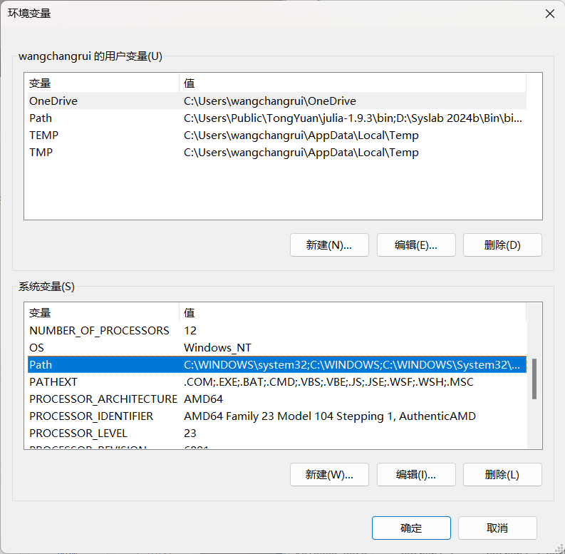

# Anaconda_安装

## Windows 系统安装 Anaconda
科学上网打开浏览器，访问 [Anaconda 官网](https://www.anaconda.com/download/) 下载适用于 Windows 的 Anaconda 安装程序（64-bit Installer）。
以管理员身份运行 .exe 文件，如下所示：
<div align="left">

</div>
点击 “Next” 继续：
<div align="left">

</div>
点击 “I Agree” 接受许可协议：
<div align="left">

</div>
选择安装类型为 “Just Me” (推荐)，点击 “Next” 继续：
<div align="left">

</div>
选择安装位置为 “D:\anaconda3”，点击 “Next” 继续：
<div align="left">

</div>
勾选图示选项，点击 “Install” 开始安装：
<div align="left">

</div>
安装完成后，点击 “Next” 继续：
<div align="left">

</div>
点击 “Next” 继续：
<div align="left">

</div>
点击 “Finish” 退出安装程序。

下一步是修改系统环境变量。
<div align="left">

</div>
在开始菜单搜索 “编辑系统环境变量”：
<div align="left">

</div>
点击环境变量：
<div align="left">

</div>
在系统变量中选择 “Path”，点击 “编辑”：
<div align="left">

</div>
“新建” 与 `anaconda` 相关的四个环境变量，点击 “确定” 即可。

---

## Windows 系统创建虚拟环境并打开 Jupyter Notebook
上述安装操作完成后，在开始菜单中，搜索 “cmd” 或 “命令提示符”，右键选择“以管理员身份运行” 打开终端。
依次执行以下命令：
``` 
conda --version # 查看 conda 版本，验证是否安装成功。
conda init # 修改终端配置文件以支持 Conda 环境切换。
conda create -n wchr python=3.9 # 创建 Python 3.9 虚拟环境，安装过程会提示确认安装的包及依赖项，输入 y 确认。
conda activate wchr # 激活刚刚创建的 wchr 虚拟环境。
conda install jupyter # 安装 Jupyter，同样会提示确认安装的包及依赖项，输入 y 确认。
jupyter notebook # 启动 Jupyter Notebook，并在浏览器中自动打开主页。
```
需要关闭 Jupyter Notebook 时，在 Jupyter Notebook 的主页上，点击 Files > Shut Down 停止服务器。

---

## 在虚拟环境下安装第三方库
确保在想要安装的环境中。使用 `pip` 安装指定版本的第三方库，以 ASE 为例：
```
pip install ase==3.22.1 # 3.22.1 是版本号，可以不指定
```
或者使用 `conda` 安装，以 spglib 为例：
```
conda install -c conda-forge spglib # -c 用于指定要从哪个 channel 安装
```