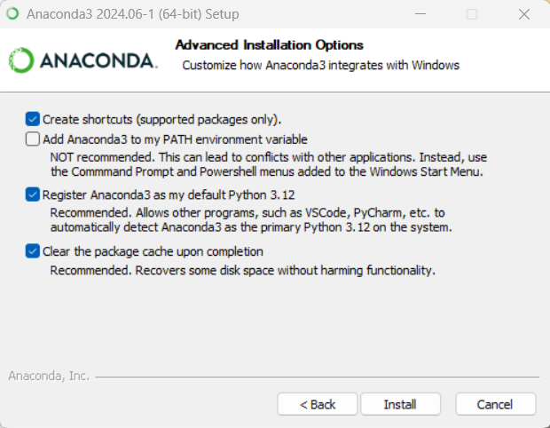
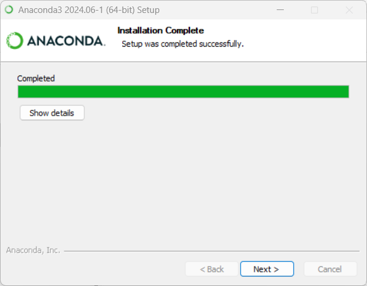
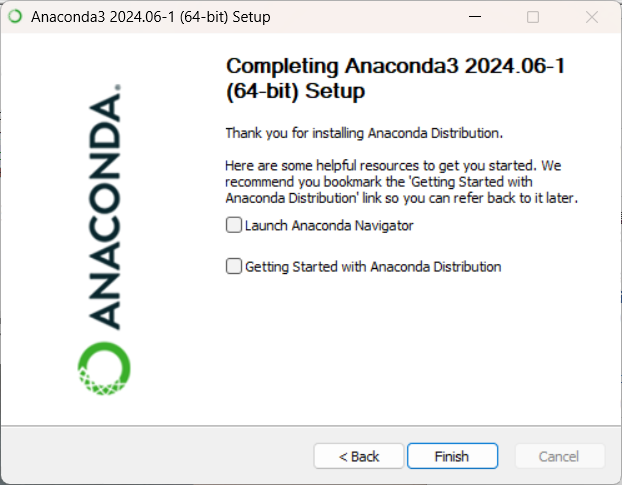
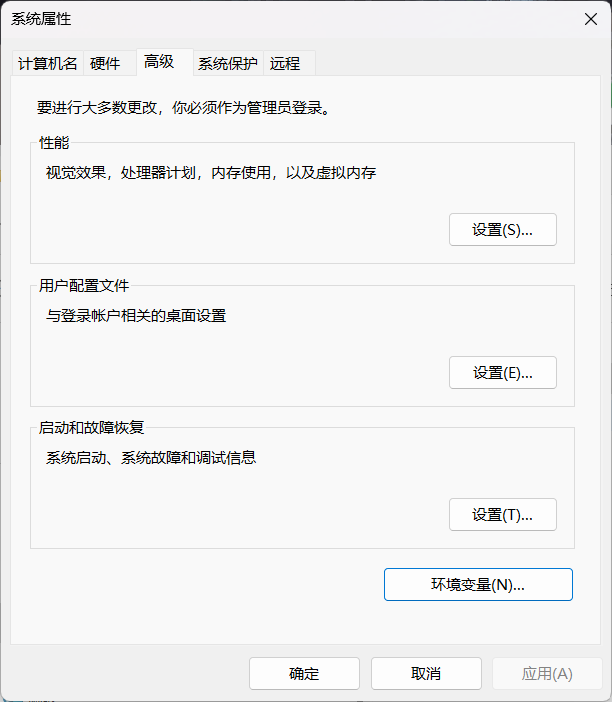

# Anaconda_安装

## Windows 系统安装 Anaconda

1. 下载安装包
科学上网打开浏览器，访问 [Anaconda 官网](https://www.anaconda.com/download/) 下载适用于 Windows 的 Anaconda 安装程序（64-bit Installer）。

2. 安装 Anaconda
以管理员身份运行 .exe 文件，如下所示：
<div align="left">

</div>
点击 “Next” 继续：
<div align="left">

</div>
点击 “I Agree” 接受许可协议：
<div align="left">

</div>
选择安装类型为 “Just Me” (推荐)，点击 “Next” 继续：
<div align="left">

</div>
选择安装位置为 “D:\anaconda3”，点击 “Next” 继续：
<div align="left">

</div>
勾选图示选项，点击 “Install” 开始安装：
<div align="left">

</div>
安装完成后，点击 “Next” 继续：
<div align="left">

</div>
点击 “Next” 继续：
<div align="left">

</div>
点击 “Finish” 退出安装程序。

3. 修改系统环境变量
<div align="left">

</div>
在开始菜单搜索 “编辑系统环境变量”：
<div align="left">

</div>
点击环境变量：
<div align="left">

</div>
在系统变量中选择 “Path”，点击 “编辑”：
<div align="left">

</div>
“新建” 与 `anaconda` 相关的四个环境变量，点击 “确定” 即可。

---

## Windows 系统创建虚拟环境并打开 Jupyter Notebook
上述安装操作完成后，在开始菜单中，搜索 “cmd” 或 “命令提示符”，右键选择“以管理员身份运行” 打开终端。
依次执行以下命令：
``` 
conda --version # 查看 conda 版本，验证是否安装成功。
conda init # 修改终端配置文件以支持 Conda 环境切换。
conda create -n wchr python=3.9 # 创建 Python 3.9 虚拟环境，安装过程会提示确认安装的包及依赖项，输入 y 确认。
conda activate wchr # 激活刚刚创建的 wchr 虚拟环境。
conda install jupyter # 安装 Jupyter，同样会提示确认安装的包及依赖项，输入 y 确认。
jupyter notebook # 启动 Jupyter Notebook，并在浏览器中自动打开主页。
```
需要关闭 Jupyter Notebook 时，在 Jupyter Notebook 的主页上，点击 Files > Shut Down 停止服务器。

---

## 在虚拟环境下安装第三方库
确保在想要安装的环境中。使用 `pip` 安装指定版本的第三方库，以 ASE 为例：
```
pip install ase==3.22.1 # 3.22.1 是版本号，可以不指定
```
或者使用 `conda` 安装，以 spglib 为例：
```
conda install -c conda-forge spglib # -c 用于指定要从哪个 channel 安装
```

---

## Linux 系统安装 Anaconda

1. 下载安装包
科学上网打开浏览器，访问 [Anaconda 官网](https://www.anaconda.com/download/) 下载适用于 Linux 的 `.sh` 格式的 Anaconda 安装程序（64-bit Installer），并拖入集群。
使用命令 `chmod u+x Anaconda3-2023.07-2-Linux-x86_64.sh` 获取可执行权限。


2. 安装 Anaconda
使用命令 `ssh cu02` 切换到编译节点。
`./Anaconda3-2020.07-Linux-x86_64.sh` 运行安装包，回车开始安装，键入 `q` 跳过相关条款阅读，键入 `yes` 接受许可证。
Anaconda 默认安装在用户主目录下，直接回车即可安装。
弹出 `Do you wish the installer to initialize Anaconda3 by running conda init?` 时，键入 `no` 回车即可。

3. 修改系统环境变量
编辑 `~/.bashrc` 文件并增加一行：

```
export PATH=/home/changruiwang-ICME/anaconda3/bin:${PATH}
```

使用命令 `conda --version` 检查 Anaconda 是否安装成功。
使用命令 `python` 即可打开 Python，输入 `exit()` 退出 Python。

升级或者恢复 Anaconda 时不需要卸载，只需要下载新的安装包，然后 `./Anaconda3-2023.09-0-Linux-x86_64.sh -u` 即可。

集群 2 的账号不推荐自行安装最新的 Anaconda，因为安装进度可能会卡在 Unpacking payload 那一步。
安装旧版的 Anaconda，如 `Anaconda3-2019.07-Linux-x86_64.sh`（使用命令 `locate Anaconda` 可以在集群 2 里找到安装包，默认的 Python 3.7.3）。

---

## Linux 系统创建虚拟环境

集群断网时，命令 `conda create -n XXX --clone base` 通过克隆 base 环境创建虚拟环境 XXX。
联网时，命令 `conda create -n XXX python=3.9` 创建指定 Python 版本的虚拟环境 XXX。

`source activate XXX` 激活 XXX 环境；
`conda deactivate` 退出当前虚拟环境；
`conda env list` 查看已创建的环境；
`conda remove -n XXX --all` 删除虚拟环境。

集群里，后续自行安装的第三方库建议都安装在虚拟环境中避免污染 base 环境。
命令 `which python` 查看当前环境的 Python 执行路径。

## pip 安装注意事项

可以尝试使用国内镜像源（如清华大学的镜像源），这可以提高下载速度并绕过可能的 SSL 问题。
使用清华镜像源的方法如下：
```
pip install d2l==0.17.6 -i https://pypi.tuna.tsinghua.edu.cn/simple
```

如果不想让 pip 自动降级已有的包，可以使用 `--no-deps` 选项来禁止安装依赖项的更新或降级。
这样，pip 会仅安装指定的包，而不会更改其他已安装的包版本，例如：
```
pip install d2l==0.17.6 --no-deps
```

在某些情况下，如果不确定是否会降级已有包，可以在执行安装前，查看安装的包的当前版本，并记录下来。
安装后，可以验证包是否发生了变化。
如果遇到频繁的降级问题，也可以考虑使用 `pip freeze` 来锁定当前环境的包版本，并将其保存到一个文件中：
```
pip freeze > requirements.txt
```
安装或更新 d2l 后，再通过：
```
pip install -r requirements.txt
```
来恢复原有环境中的包版本。