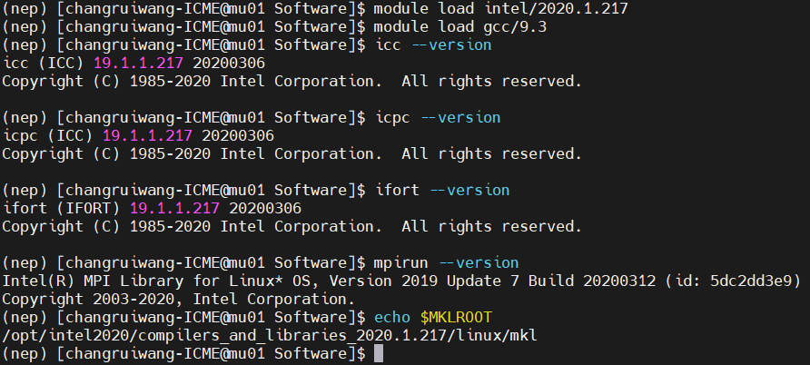

# QE 编译

## 集群 3 编译 QE 7.3.1

编译前需要`ssh cu02`切换到编译节点（cu02），并加载编译环境如下：

```shell
module load intel/2020.1.217
module load gcc/9.3
```

执行以下命令查看编译环境是否加载成功：

```shell
icc --version
icpc --version
ifort --version
mpirun --version
echo $MKLROOT
```

输出以下信息即可：

<div align="left">

</div>

访问 [QE 官网](https://www.quantum-espresso.org/) 下载 QE 安装包，以 `qe-7.3.1-ReleasePack.tgz` 为例。
依次执行以下命令：

```shell
tar -zvxf qe-7.3.1-ReleasePack.tar.gz
cd qe-7.3.1/
./configure --with-cuda=no --with-scalapack=intel --with-scalapack-qrcp=yes MPIF90=mpiifort FC=ifort FCFLAGS=-O3 CC=mpiicc CFLAGS=-O3
vi make.inc
make all -j
make epw
```

注意修改 `make.inc` 对应字段为以下内容：

```shell
FFLAGS = -O3 -assume byterecl -g -traceback
BLAS_LIBS = -L${MKLROOT}/lib/intel64 -lmkl_scalapack_lp64 -lmkl_intel_lp64 -lmkl_sequential -lmkl_core -lmkl_blacs_intelmpi_lp64 -lpthread -lm -ldl
LAPACK_LIBS = -L${MKLROOT}/lib/intel64 -lmkl_scalapack_lp64 -lmkl_intel_lp64 -lmkl_sequential -lmkl_core -lmkl_blacs_intelmpi_lp64 -lpthread -lm -ldl
SCALAPACK_LIBS = -L${MKLROOT}/lib/intel64 -lmkl_scalapack_lp64 -lmkl_intel_lp64 -lmkl_sequential -lmkl_core -lmkl_blacs_intelmpi_lp64 -lpthread -lm -ldl
FFT_LIBS = -L${MKLROOT}/lib/intel64 -lmkl_scalapack_lp64 -lmkl_intel_lp64 -lmkl_sequential -lmkl_core -lmkl_blacs_intelmpi_lp64 -lpthread -lm -ldl
MPI_LIBS = -L/opt/intel2020/impi/2019.7.217/intel64/lib
```

正常结束的话，`qe-7.3.1/bin` 目录里有各种 `.x` 结尾的可执行程序，代表安装成功。

编译完成后记得使用命令 `logout` 退出编译节点。

## QE 提交脚本

下面给出 QE 在集群 3 适用的 PBS 提交脚本：

```shell
#PBS -N qe
#PBS -l nodes=1:ppn=24
#PBS -l walltime=600:00:00
#PBS -q batch
#PBS -V
#PBS -S /bin/bash

export MODULEPATH=/opt/modulefiles
module load intel/2020.1.217
module load gcc/9.3

NP=`cat $PBS_NODEFILE | wc -l`
NN=`cat $PBS_NODEFILE | sort | uniq | tee /tmp/nodes.$$ | wc -l`

cat $PBS_NODEFILE > /tmp/nodefile.$$
cd $PBS_O_WORKDIR
ulimit -s unlimited

EXEC=/home/changruiwang-ICME/Software/qe-7.3.1/bin/pw.x
mpirun -machinefile $PBS_NODEFILE -np $NP $EXEC -pd .true. < pw.inp > output
```

## 赝势下载

[QE 官网](https://www.quantum-espresso.org/pseudopotentials/) 给出了 SSSP 赝势的下载链接，赝势文件可以直接下载。
以 SSSP_1.3.0_PBE_efficiency.tar.gz 为例，下载后拖入集群解压（最好是把赝势都放在一个文件夹下）。
在输入文件中指定赝势路径即可。
