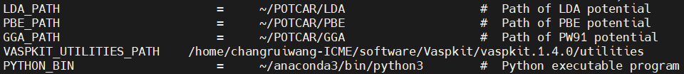

# VASPKIT 安装

VASPKIT 是 VASP 计算最常用的后处理工具。
访问 [官网](https://sourceforge.net/projects/vaspkit/files/Binaries/) 下载 VASPKIT 安装包并拖入集群使用下面命令解压：

```shell
tar -zxvf vaspkit.1.4.0.linux.x64.tar.gz
```

然后 `cd vaspkit.1.4.0/` 进入解压后的文件夹，使用命令 `./setup.sh` 开始安装。
安装完成后需要添加环境变量：

```shell
export PATH=/home/XXX/Vaspkit/vaspkit.1.4.0/bin:$PATH
``` 

然后 `source ~/.bashrc` 加载配置文件。
使用命令 `vaspkit` 查看 VASPKIT 是否安装成功。

`vi ~/.vaspkit` 修改 LDA_PATH、PBE_PATH、GGA_PATH、vaspkit_UTILITIES_PATH、PYTHON_BIN 为自己集群账号的对应路径，如下所示：

<div align="left">

</div>
 
在 `~/.vaspkit` 文件中修改 `SET_MINI_INCAR` 为 `.TRUE.` 可以清除 VASPKIT 生成的 INCAR 中的注释。

---

VASPKIT 的使用非常简单，基本就是按提示输入数字或者某些关键字。
有问题可以求助 [VASPKIT 官网](https://vaspkit.com/) 。
VASPKIT 教程参见 [VASPKIT---VASP软件预-后处理工具介绍](https://github.com/tamaswells/VASPKIT_manual/blob/master/manual/VASPKIT%E2%80%94VASP%E8%BD%AF%E4%BB%B6%E9%A2%84-%E5%90%8E%E5%A4%84%E7%90%86%E5%B7%A5%E5%85%B7%E4%BB%8B%E7%BB%8D.md) 
或者 [Tutorials](https://vaspkit.com/tutorials.html) 即可。

下面两种 shell 格式可用于批量使用 VASPKIT：

```shell
echo -e "102\n2\n0.04\n" | vaspkit
(echo 102; echo 2; echo 0.04) | vaspkit
```