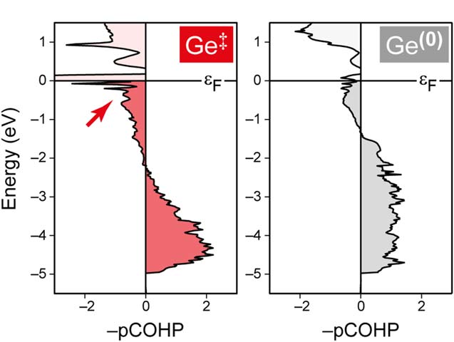
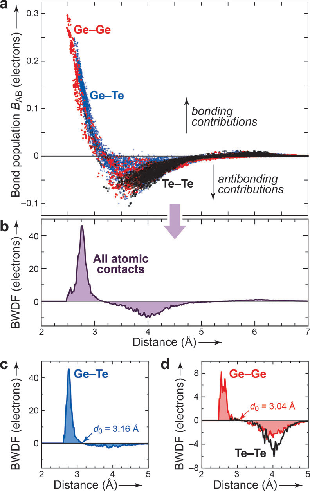

# VASP Lobster 键合分析

Lobster（Local Orbital Basis Suite Towards Electronic-Structure Reconstruction）是一个强有力的键合分析工具。
下面介绍 Lobster 计算 COOP 和 COHP 的一般计算流程，你可以使用它们来分析 DFT 计算中的成键、反键贡献。

在自洽计算的基础上，`cp scf/ lobster/` 并删除 `lobster/` 中的波函数文件 `WAVECAR`。
使用命令 `grep NBANDS OUTCAR` 查看自洽计算默认的 NBANDS。修改 `lobster/INCAR` 如下所示：

```
SYSTEM = GeTe

ISTART = 0
ICHARG = 2
LCHARG = .F.
LWAVE = .T.
ISYM = 0

ALGO = Normal
NELM = 120
AMIX = 0.2
BMIX = 0.0001
EDIFF = 1E-06

NBANDS = 3024

LORBIT = 12
NEDOS = 2000

IBRION = -1
NSW = 0

ENCUT = 600
ISMEAR = 0
SIGMA = 0.05
PREC = A
LREAL = .F.
ADDGRID = .T.
```

关键设置包括：
- 设置 LWAVE = .T. 输出波函数（静态计算开始前请删除 WAVECAR 避免出错）。
- 注意不要使用 US-PP 超软赝势，使用 PAW 赝势。在计算中尽量避免使用带有 `_sv` 后缀的 POTCAR。
- 请使用 vasp_std，目前尚不支持 vasp_gam 版本。
- 不支持处理对称，所以需要设置 ISYM = 0 或 ISYM = -1 来关闭对称性。

对于复杂体系（如低对称性结构或含缺陷材料），输出 IBZKPT 后，可以 `cp IBZKPT KPOINTS`，再重新提交作业。
`cp IBZKPT KPOINTS` 往往能显著提升积分精度和 COHP 结果的可靠性，特别是对于局域态和异质界面。

如果系统本身具有强烈的自旋-轨道耦合（例如某些重元素或磁性材料），启用 LSORBIT = .T. 能够更真实地描述这些效应。

计算完成后，在当前目录创建一个新的文件夹 `lobster_out`，
将 `CONTCAR`、`KPOINTS`、`POSCAR`、`POTCAR`、`OUTCAR`、`WAVECAR` 和 `vasprun.xml` 复制到这个文件夹中。
然后编辑一个名为 `lobsterin` 的文件，内容如下：

```
COHPStartEnergy -10
COHPEndEnergy 5

usebasisset pbeVaspFit2015
gaussianSmearingWidth 0.05				! 使用高斯展宽时与 VASP 输入的 SIGMA 一致
includeOrbitals s p						! 轨道类型，自行修改
basisFunctions Ge 4s 4p 				! 指定元素种类以及轨道
basisFunctions Te 5s 5p

! cohpBetween atom 1 atom 2 orbitalWise	! 分析指定原子键合
cohpGenerator from 2.0 to 4.0 type Ge type Te orbitalWise ! 根据截断距离分析一类原子键合
cohpGenerator from 3.5 to 5.0 type Ge type Ge orbitalWise
cohpGenerator from 3.5 to 5.0 type Te type Te orbitalWise

skipDOS									! 跳过DOS计算
skipCOOP								! 跳过COOP计算
! skipCOHP								! 跳过COHP计算

saveProjectionToFile
! loadProjectionFromFile
```

saveProjectionToFile 选项会把投影计算结果保存到 projectionData.lobster 中。
由于投影计算耗时较长，所以一般在第一次计算的时候设置这个参数；
后续计算可以使用 loadProjectionFromFile 参数读取 projectionData.lobster 加速计算。

不确定 cohpGenerator 的键长指定范围时，可以使用命令 `python get_bond_total.py` 输出 `distance.sh`，内含不同原子间距对应的所有原子对。
也可以使用 OVITO 中的 Coordination analysis 功能查看径向分布函数确认。

命令行键入 `lobster-4.1.0` 即可输出 `COHPCAR.lobster`、`ICOHPLIST.lobster`、`COOPCAR.lobster`、`ICOOPLIST.lobster` 等文件。
但集群里更推荐使用 `qsub runlobster.pbs` 的方式提交作业以避免内存溢出。

`COHPCAR.lobster` 第一列为能量，第二列为指定原子平均的 pCOHP，第三列是 pCOHP 的积分。
`ICOHPLIST.lobster` 则反映了原子间距和 ICOHP 的关系。

推荐使用 wxdragon 进行可视化分析：
```
wxdragon DOSCAR.lobster
wxdragon COHPCAR.lobster
```
python 绘图参考 [网址](https://matgenb.materialsvirtuallab.org/2019/01/11/How-to-plot-and-evaluate-output-files-from-Lobster.html) ，样图示例如下：

<div align="left">

</div> 

对于非晶体系，wxDragon 可以在 Lobster 输出文件 `BWDF.dat` 的基础上做键加权分布函数（BWDF）分析，样图示例如下：

<div align="left">

</div> 