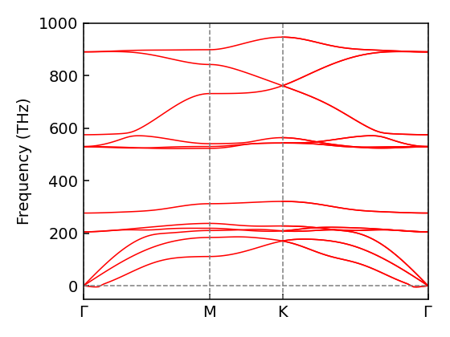

# 声子谱计算

1. 准备进行过结构优化的 POSCAR
2. `phonopy -d --dim="2 2 1"  # 在 xyz 方向扩胞大小
3. 此时应该有：phonopy_disp.yaml  POSCAR-001  POSCAR-003  POSCAR-005  POSCAR-002  POSCAR-004  POSCAR-006  SPOSCAR POSCAR 这些文件，然后`cp POSCAR POSCAR_unit`  `mv SPOSCAR POSCAR` # 生成了 SPOSCAR文件，把原来的 POSCAR 保存为 POSCAR_unit，把SPOSCAR 改名为 POSCAR 用于后续计算
4. 准备 INCAR

```
IOPTCELL = 1 1 0 1 1 0 0 0 0 # 控制z方向不变
ADDGRID = True
ALGO = Normal
EDIFF = 1e-08
ENCUT = 600
IBRION = 8
ISIF = 3
ISMEAR = 0
ISPIN = 1
ISYM = 2
LASPH = True
LCHARG = False
LORBIT = 11
LREAL = False
LWAVE = False
NELM = 100
NSW = 1
POTIM = 0.01
PREC = Normal
SIGMA = 0.1
EDIFFG = -1e-03

```
5. 生成KPOINTS，方法和做结构优化的一样，复制pbs文件，提交
6. 算完之后，vaspkit 305 2 —— 生成KPATH.phonopy 和 band.conf
7. `grep hession vasprun.xml` 显示 说明计算成功
8. `phonopy --fc vasprun.xml # 获得力常熟文件
9. `grep THz OUTCAR` # 查看虚频
10. `cp KPATH.phonopy band.conf`  `vi band.conf`
11. 
```
ATOM_NAME = B Cr Mo # 这里原来没有，需要加上原子种类
NPOINTS = 501
DIM = 2 2 1 #在 xyz 方向扩胞大小
BAND = 0.000000 0.000000 0.000000 0.500000 0.000000 0.000000 0.333333 0.333333 0.000000 0.000000 0.000000 0.000000
BAND_LABELS = $\Gamma$ M K $\Gamma$

MP = 30 30 30
TETRAHEDRON = .TRUE.
#PDOS = 1 2 3 4 5 6 7 8 9 10 11 12 13 14 15 16 17 18 19 20 21 22 23 24 25 26 27 28 29 30 31 32 33 34 35 36 37 38 39 40 41 42 43 44 45 46 47 48 49 50, 51 52 53 54 55 56 57 58 59 60 61 62 63 64 65 66 67 68 69 70 71 72 73 74 75, 76 77 78 79 80 81 82 83 84 85 86 87 88 89 90 91 92 93 94 95 96 97 98 99 100 #是否计算PDOS，算的话取消注释
BAND_CONNECTION = .TRUE.
FORCE_CONSTANTS = READ

# FORCE_SETS = READ
# IRREPS = 0  0  0
# SHOW_IRREPS = .TRUE.
# LITTLE_COGROUP = .TRUE.

```
12. `phonopy --dim="2 2 1" -c POSCAR_unit band.conf`  `mv POSCAR SPOSCAR`  `mv POSCAR_unit POSCAR` `phonopy --factor=521.471 band.conf`  `phonopy -bandplot --gnuplot band.yaml > band.dat`
13. `cp ~/script/phonbydat.py .`  `python phonbydat.py band.dat`
14. 绘制声子谱如图
<div align="left">

</div>

