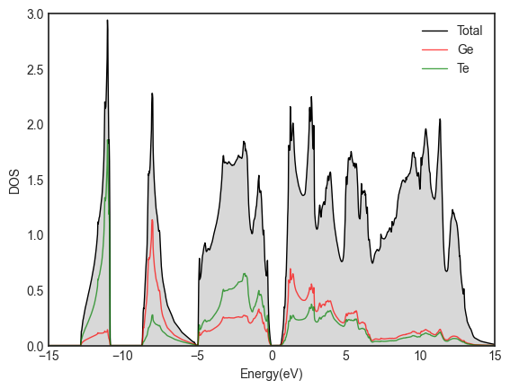
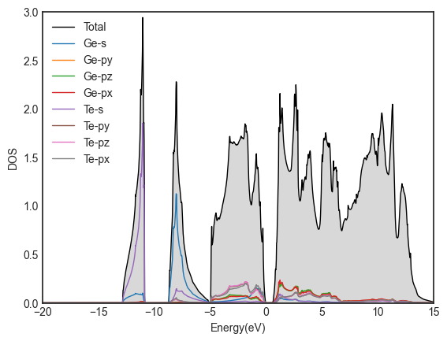
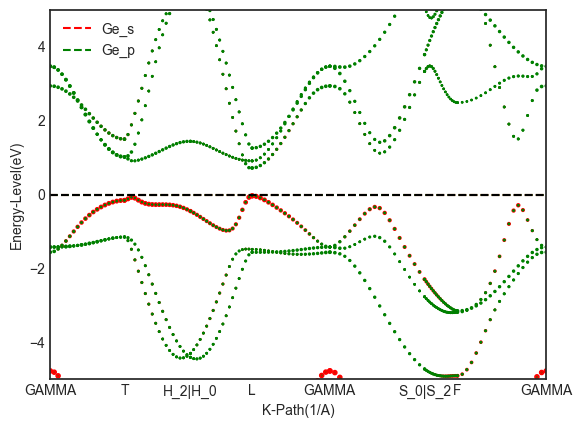
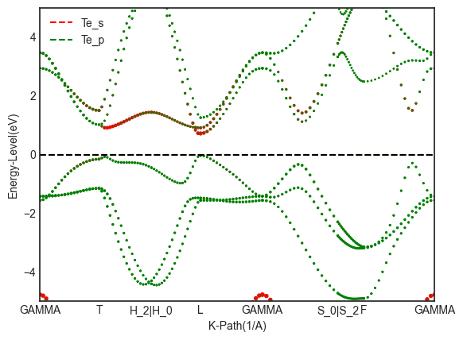

# VASP 能带态密度计算

## 态密度计算

态密度（DOS）计算需要自洽计算输出的 `CHGCAR` 和 `WAVECAR`。
另外 DOS 计算还需要更密的 K 点网格，因此 KPOINTS 不妨取自洽计算的两倍甚至更大。
`INCAR` 的关键参数是 `IBRION`、`LORBIT` 和 `NEDOS`，另外设置 `ISMEAR = -5` 能获得更平滑的 DOS。

这里给出一个态密度计算的 `INCAR` 示例：

```
# CONTROL
SYSTEM = GeTe
NCORE = 8
ISTART = 1			# 读取 WAVECAR
ICHARG = 11			# 读取自洽的 CHGCAR
LCHARG = .F.
LWAVE = .F.

# ELECTRONS
ALGO = Fast
NELM = 120
EDIFF = 1E-06

# IONS
IBRION = -1			# 不再进行离子弛豫
NSW = 0

# DOS
LORBIT = 11			# 10计算局域态密度，11计算投影态密度
NEDOS = 2001

# PRECISION
ENCUT = 400
ISMEAR = 0
SIGMA = 0.05
PREC = A
LREAL = F	
ADDGRID = .T.
```

计算完成后使用 `vaspkit 111` 导出总态密度 `TDOS.dat`；
或者使用 `vaspkit 112` 导出分波态密度 `PDOS_Ge.dat` 和 `PDOS_Te.dat`。
导入 Origin 画图如下所示：

<div align="left">

</div>

<div align="left">

</div>

由于分波投影态密度计算精度的限制，分波态密度之和往往小于总态密度（没有考虑 d 轨道作用有很大的影响）。
由上图可知，相邻 Ge、Te 的 s 轨道之间形成很强的 σ 键。

---

## 能带计算

对完美晶体，能带计算时推荐使用原胞。
使用 `vaspkit 602` 可以从 `POSCAR` 找到对应的标准化原胞 `PRIMCELL.vasp`。
用 `PRIMCELL.vasp` 覆盖原有的 `POSCAR`，以确保后续 vaspkit 生成的高对称 K 点路径和实空间的晶胞方向是匹配的。

依次进行结构优化和自洽计算，接着 `vaspkit 303` 生成简约布里渊区高对称 K 点路径文件 `KPATH.in`，重命名为 `KPOINTS`（如果最后画出来的能带不连续或者锯齿特别多，可以增大 `KPOINTS` 第二行的插值数）。
能带计算和态密度计算的 `INCAR` 一致，注意 `IBRION`、`LORBIT` 和 `NEDOS` 等相关设置。

计算完成后，运行 `vaspkit 211` 处理能带数据并返回相应的 `BAND.dat`、`REFORMATTED_BAND.dat`、`KLINES.dat`、`BAND_GAP` 文件。
运行 `vaspkit 213` 处理投影能带数据并返回相应的 `PBAND_Ge.dat`、`PBAND_Te.dat`、`KLABELS` 文件。

将这些文件拷贝下来，绘图如下：

<div align="left">

</div>

<div align="left">

</div>

为了得到平滑的能带色散曲线，可在 `~/.vaspkit` 文件中设置以下三个参数以激活插值功能：

```
GET_INTERPOLATED_DATA = .TRUE. # 是否插值
INTERPOLATION_SPACING = 0.04 # 插值间距，越小越平滑但数据占用空间也相应增加
INTERPOLATION_METHOD = 'cubic' # 插值方法
```

---

## 能带反折叠计算

真实材料中，材料的缺陷浓度及杂质浓度非常低，在利用第一性原理计算研究中必须采用超胞模型。
然而，由于超胞的能带结构无法直接与完美体系的能带做比较，因此讨论缺陷及杂质如何影响基质材料的电学性质具有一定的难度。
根据有效能带理论（Effective Band Structure）可以把超胞的能带结构变换到原胞的布里渊区，操作流程如下：

1. 准备 POSCAR；
2. 运行 `vaspkit 303` 生成 `KPATH.in` 文件；
3. `cp PRIMCELL.vasp POSCAR`；
4. 结构优化，并 `cp CONTCAR POSCAR`；
5. 运行 `vaspkit 400` 生成超胞 `POSCAR`，并 `cp TRANSMAT TRANSMAT.in`；
6. 结构优化含有缺陷的超胞结构，并 `cp CONTCAR POSCAR`；
7. 运行 `vaspkit 281` 生成 `KPOINTS` 文件；
8. 设置 `LWAVE = .T.`，适当增加 `NBANDS` 值，并执行 VASP 能带计算；
9. 运行 `vaspkit 282` 提取有效能带；
