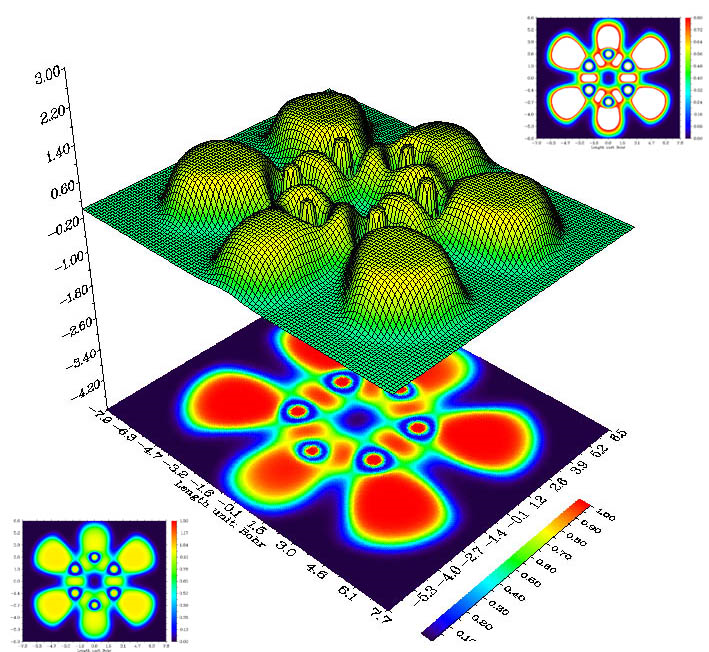
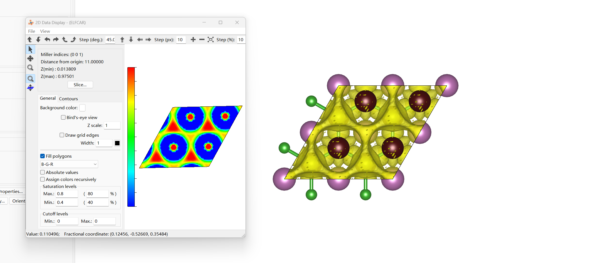
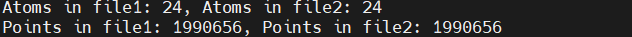
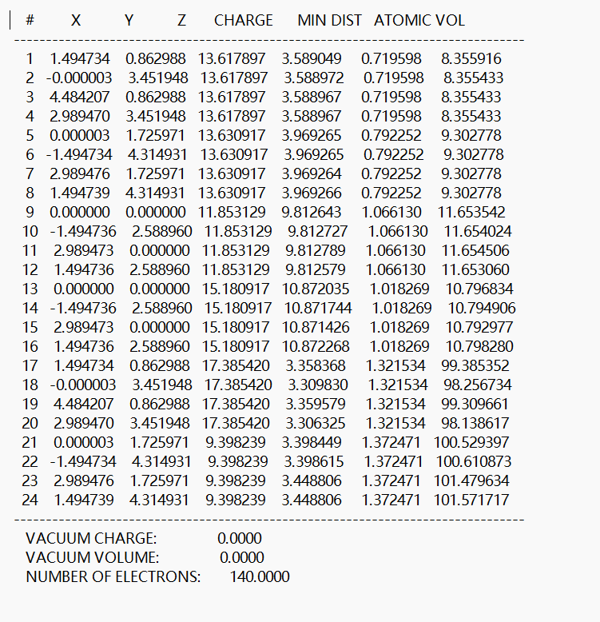
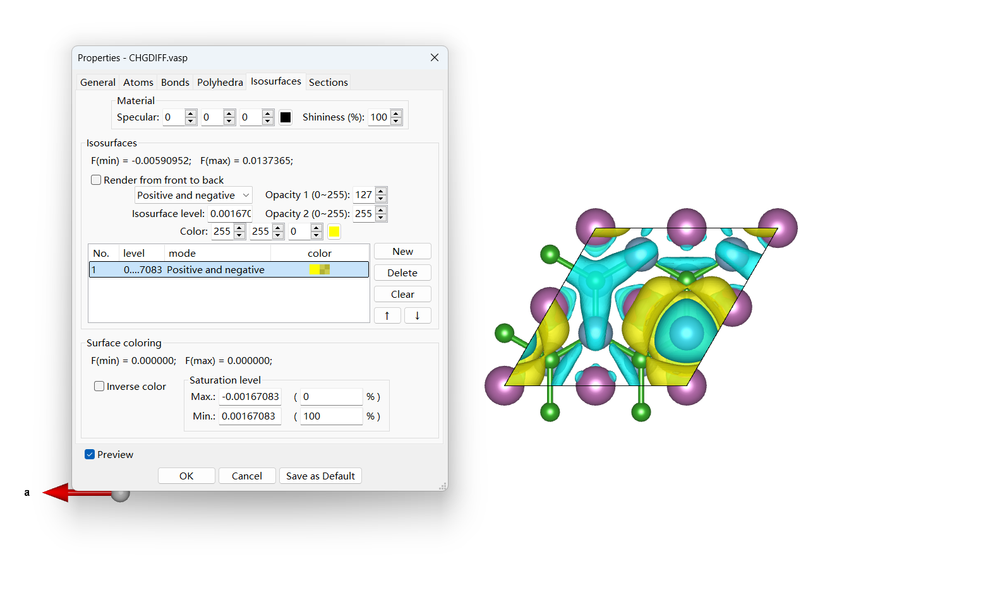

# VASP 电子结构分析

贡献者：胡京京、王昌锐

---

本节将简单介绍

1. ELF（电子局域函数）分析；
2. Bader 电荷分析；
3. CDD（差分电荷密度）；
4. Lobster 键合分析；

以 2D 六方 Sc2B2 MBene 为例。所有静态计算前均要先进行结构优化。

## ELF（电子局域函数）分析

ELF 是个三维实空间函数，数值范围在 0 到 1 之间。其中，`ELF = 1` 表示完全局域化；`ELF = 0` 表示完全离域化；`ELF = 0.5` 这个中间值则表示该处电子形成了类似于电子气的电子对分布。
简而言之，数值较高的 ELF 等值面包围的区域，电子定域性较强，不容易跑出去。
而在那些 ELF 数值较低的区域，电子定域性较弱，即如果把电子放在那里，就很容易离域到其它区域去。

下图中间的图是吡嗪（C4H4N2）分子平面 ELF 的地形图和投影图。
投影图部分单独拿出来就是 VESTA 中的填色图。
图中 C-N、C-C 化学键、N 的孤对电子都清楚地显示了出来。

<div align="left">

</div>

在 INCAR 中设置 `LELF=.T`. 即可计算 ELF 并返回 ELFCAR 文件。INCAR 如下所示：

```
IOPTCELL = 1 1 0 1 1 0 0 0 0
SYMPREC = 1E-06

ISTART = 0
ICHARG = 2
LCHARG = .F.
LWAVE = .F.
IVDW = 10

ALGO = Normal
NELM = 120
EDIFF = 1E-05
LELF = .T. # !!!

IBRION = -1
NSW = 0
EDIFFG = -1E-03

ENCUT = 600
ISMEAR = 0
SIGMA = 0.05
PREC = A # !!!
LREAL = A
ADDGRID = .T.
```

用 VESTA 软件打开输出的 ELFCAR，单位是 $e/bohr^3$。
注意 VESTA 中要合理地设置 isosurface level（三维）或 slice（二维）。
绘制二维切面图时，可以先选中三个原子，再通过 Utilties → 2D Data Display → Contours → Slice → hkl → Calculate the best plane for the selected atoms 调节晶面指数和距离，找到你想绘制的平面。
通过 Saturation Levels 调节左边 Color bar 的显示范围，即 Max 和 Min 值，得到你想要的 ELF 二维切面图。
如下图所示：

<div align="left">

</div>

注意，目前 VASP 不支持在自旋轨道耦合计算（`LSORBIT=.T.`）和非共线磁性计算（`LNONCOLLINEAR=.T.`)时输出 ELFCAR。

---

## Bader 电荷分析

在 VASP 中，可以通过计算 Bader 电荷来近似估算每个原子的化合价。
Bader 方法通过电荷密度的零通量面划分原子空间，从而计算每个原子的电荷分布，进而分析原子间的电荷转移情况。

在 Bader 电荷分析中，假定电荷密度的最大值位于原子或伪原子的中心。
但由于中心电荷计算成本较高，且对键合性质影响不大，VASP 使用赝势来移除中心电荷。
因此，VASP 输出的电荷密度文件（CHGCAR）仅包含价电子的电荷密度。

为进行 Bader 电荷分析，需在 INCAR 文件中设置 `LAECHG = .T.`，使得核电荷密度写入 AECCAR0 文件，价电荷密度写入 AECCAR2 文件。
然后，将 AECCAR0 和 AECCAR2 合并生成总电荷密度文件 AECCAR，使用 `chgsum.pl` 脚本完成合并。

INCAR 如下所示：
```
IOPTCELL = 1 1 0 1 1 0 0 0 0
SYMPREC = 1E-06

ISTART = 0
ICHARG = 2
LCHARG = .T. # !!!
LWAVE = .F.
IVDW = 10

ALGO = Normal
NELM = 120
EDIFF = 1E-05
LAECHG = .T. # !!!

IBRION = -1
NSW = 0
EDIFFG = -1E-03

ENCUT = 600
ISMEAR = 0
SIGMA = 0.05
PREC = A # !!!
LREAL = A
ADDGRID = .T. 
```

静态计算完成后，使用 `chgsum.pl AECCAR0 AECCAR2` 计算总电荷密度，返回如下提示并输出 `CHGCAR_sum`。

<div align="left">

</div>

然后使用命令 `bader CHGCAR -ref CHGCAR_sum` 输出 `ACF.dat` 文件。
`ACF.dat` 中第一列是原子序号（原子顺序与 POSCAR 相同），X、Y、Z 列依次是原子的笛卡尔坐标，CHARGE 一列对应的就是每个原子的剩余电荷，如图所示：
<div align="left">

</div> 
通过 `grep ZVAL POTCAR` 查找赝势中每个元素原本所带的价电子数，用原来的价电子数减去剩余电荷数就可以得到转移电子数，进而求出该原子对应的化合价。

另外，使用命令 `echo 508 | vaspkit` 可以得到 `bader.pqr` 文件，能在 VMD 中打开。

注意，如果你想要一个精确的 Bader 电荷值，那么你需要一个非常精细的 FFT 网格。
因此有必要进行一系列的测试，不断的提高 NG(X,Y,Z) 的值直到总电荷不再改变为止。

---

## CDD（差分电荷密度）

CDD（差分电荷密度）即成键后的电荷密度与成键前的电荷密度之差。
通过差分电荷密度的计算和分析，可以得到成键过程中的电荷移动以及成键极化方向等性质。

下面介绍如何计算 CDD，以 Sc2B2 结构优化后得到的 CONTCAR 为例。
首先，
```
mkdir CDD
cd CDD
mkdir Sc2B2 Sc B
cp ../CONTCAR Sc2B2/POSCAR
```
类似地，Sc/ 和 B/ 下的 POSCAR 分别是 `../CONTCAR` 分别删去 B 和 Sc 原子后的剩余结构。

静态计算的 INCAR 如下所示：
```
IOPTCELL = 1 1 0 1 1 0 0 0 0
SYMPREC = 1E-06

ISTART = 0
ICHARG = 2
LCHARG = .T. # !!!
LWAVE = .F.
IVDW = 10

ALGO = Normal
NELM = 120
EDIFF = 1E-05

IBRION = -1
NSW = 0
EDIFFG = -1E-03

ENCUT = 600
ISMEAR = 0
SIGMA = 0.05
PREC = A # !!!
LREAL = A
ADDGRID = .T. 
```

静态计算完成后，使用 `vaspkit \n314`，根据提示依次输入 Sc2B2/、Sc/ 和 B/ 的 CHGCAR 文件路径，生成 CHGDIFF.vasp 文件。
用 VESTA 软件打开 CHGDIFF.vasp，在 Properties——Isosurfaces 中调整 Isosurfaces level 数值，得到你想要的 CDD 图像，如图所示：

<div align="left">

</div> 

---
