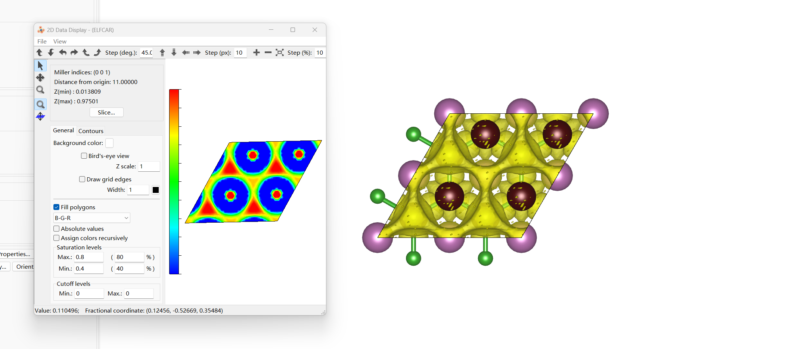
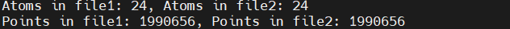
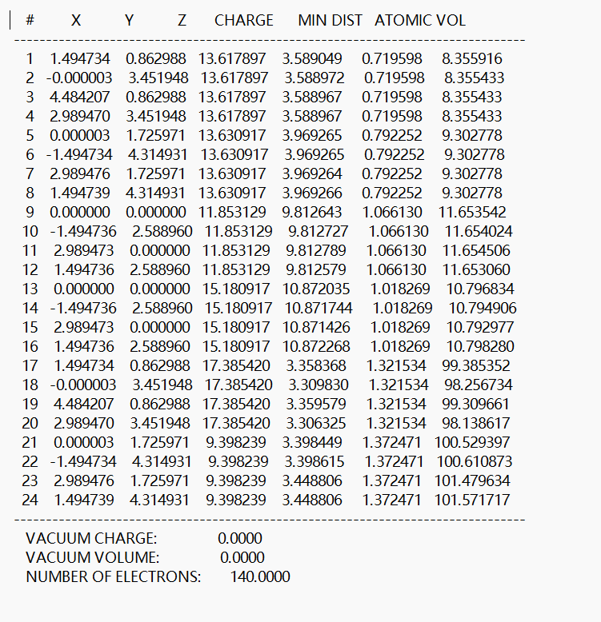
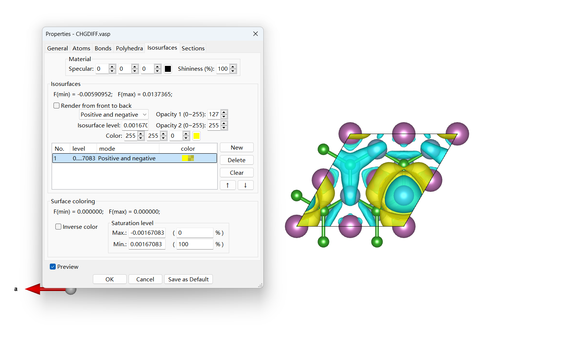

# 电子结构分析
本节将简单介绍ELF：电子局域函数；Bader电荷分析；CDD：差分电荷密度；Lobster的计算方法\
以计算2D六方Sc2B2 MBene 的电子结构分析为例：
## ELF 电子局域函数
描述以某个位置处的电子为参考，在其附近找到与他同自旋的电子的概率，可以表征这个作为参考的电子的局域化程度\
ELF = 1 完全局域化 红色\
ELF = 1/2 \
ELF = 0 完全离域化 蓝色
1. 准备 POSCAR
2. 准备 INCAR，如下

```IOPTCELL = 1 1 0 1 1 0 0 0 0 #固定z轴
ALGO = Normal
EDIFF = 1e-05
ENCUT = 600
ISMEAR = 0
SIGMA = 0.05
ISPIN = 1
IVDW = 10
LREAL = A
LWAVE = .F.
NELM = 300
NSW = 0
PREC = N
SYMPREC = 1e-06

LELF = True  #用来算ELF的
NPAR = 1
LCHARG = False
```

3. 生成 KPOINTS POTCAR 方法和做结构优化时一样
4. 准备pbs文件，提交，生成ELFCAR文件
### 后处理
用VESTA软件打开ELFCAR文件，通过Utilties——2D Data Display——Slice,调节晶面指数和距离，找到你想绘制的平面，然后调节Saturation Levels的Max和Min值，得到你想要的ELF图
<div align="left">

</div>

## Bader电荷分析
Bader电荷计算（Bader Charge Calculation）：一种通过将电子密度的零通量面作为分界面，划分原子空间，求解每一个原子上所带电荷，来分析原子组合在一起后的电荷转移情况。可以得到一个具体的电荷转移数值。
1. 准备一个结构优化好的 POSCAR
2. 准备 INCAR 文件如下

```IOPTCELL = 1 1 0 1 1 0 0 0 0 #固定z轴
ALGO = Normal
EDIFF = 1e-05
ENCUT = 600
ISMEAR = 0
SIGMA = 0.05
ISPIN = 1
IVDW = 10
LREAL = A
LWAVE = .F.
NELM = 300
NSW = 0
PREC = N
SYMPREC = 1e-06
ISYM = -1
LELF = True
NPAR = 1

LCHARG = True  
LAECHG = True  
```
3. 准备 KPOINTS POTCAR 方法和做结构优化时一样
4. 准备pbs文件，提交
### 后处理
1. 计算完成后 输入 `chgsum.pl AECCAR0 AECCAR2 #分别是核电荷和价电荷`有如下提示
<div align="left">

</div>
2. `bader CHGCAR -ref CHGCAR_sum # 得到输出文件ACF.dat和BCF.dat`
3. 以 ACF.dat 文件为例
<div align="left">

</div> 
第一列是原子数，然后XYZ依次是原子的笛卡尔坐标。CHARGE是原子的bader电荷，这个是最主要的。然后是最小距离，原子体积。通过 `grep VRHFIN POTCAR` 和 `grep ZVAL POTCAR` 查找对应原子的电子数，用原来的电荷减去CHARGE对应的电荷就可以得出转移的电子数。

## 差分电荷密度
差分电荷即成键后的电荷密度与对应的成键前的原子电荷密度之差。通过差分电荷密度的计算和分析，可以清楚地得到在成键和成键电子耦合过程中的电荷移动以及成键极化方向等性质。
1. 分别准备优化好的 Sc2B2、B、Sc 的POSCAR
2. 准备 INCAR 文件如下

```IOPTCELL = 1 1 0 1 1 0 0 0 0 #固定z轴
ALGO = Normal
EDIFF = 1e-05
ENCUT = 600
ISMEAR = 0
SIGMA = 0.05
ISPIN = 1
IVDW = 10
LREAL = A
LWAVE = .F.
NELM = 300
NSW = 0
PREC = N
SYMPREC = 1e-06
ISYM = -1
LELF = False
NPAR = 1
LCHARG = True
```

3. 准备 KPOINTS POTCAR 方法和做结构优化时一样
4. 准备pbs文件，提交
### 后处理
1. vaspkit 314 分别输入3个文件的位置
2. 生成 CHGDIFF.vasp 文件 用 VESTA 软件打开，Properties——Isosurfaces 调整 Isosurfaces level 数值，得到你想要的 CDD 图像

<div align="left">

</div> 

## LOBSTER
Lobster是用来读取和处理来自平面波DFT软件包的输出数据的,通过从离域平面波基组中重新提取原子分辨信息，Lobster可以帮你投影COOP和COHP曲线，你可以使用它们来可视化DFT计算中的成键反键贡献。
1. 准备结构优化好的 POSCAR
2. 准备 INCAR

```IOPTCRLL = 1 1 0 1 1 0 0 0 0 #固定z轴
SYSTEM = Sc2B2

#NCORE = 12
ISTART = 0
ICHARG = 2
LCHARG = .F.
LWAVE = .T. #
ISYM = 0
IVDW = 10

ALGO = Normal
NELM = 120
NBANDS = 650 #需要调高，是结构优化的1.5倍
EDIFF = 1E-08 #需要调高

IBRION = -1
ISIF = 0
NSW = 0
EDIFFG = -1E-02
LORBIT = 12

ENCUT = 600
ISMEAR = 0
SIGMA = 0.05
PREC = A
LREAL = F
ADDGRID = .T.
```
3. 准备 KPOINTS POTCAR 方法和做结构优化时一样
4. 准备pbs文件，提交 
5. 计算完成后，在当前目录创建一个新的文件夹`lobster`,将 CONTCAR KPOINTS OUTCAR POSCAR POTCAR WAVECAR vasprun.xml 复制到这个文件夹中，然后编辑一个名为 `lobsterin` 的文件，内容如下：

```COHPStartEnergy -10
COHPEndEnergy 5

basisSet pbeVaspFit2015
includeOrbitals s p d   # 轨道类型，自行修改

basisFunctions Sc 4s 3p 3d # 元素种类以及轨道
basisFunctions B 2s 2p


cohpGenerator from 2.7 to 3.0 type Sc type B #键长范围，从 POTCAR 找

gaussianSmearingWidth 0.05
```
6. 准备pbs文件，提交
7. 生成`ICOHPLIST.lobster`和`ICOOPLIST.lobster`文件。