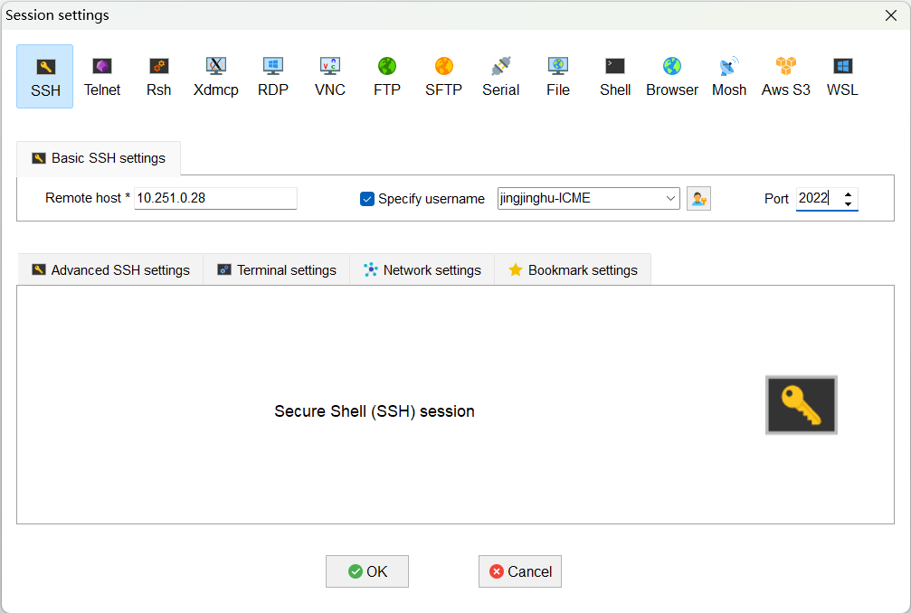
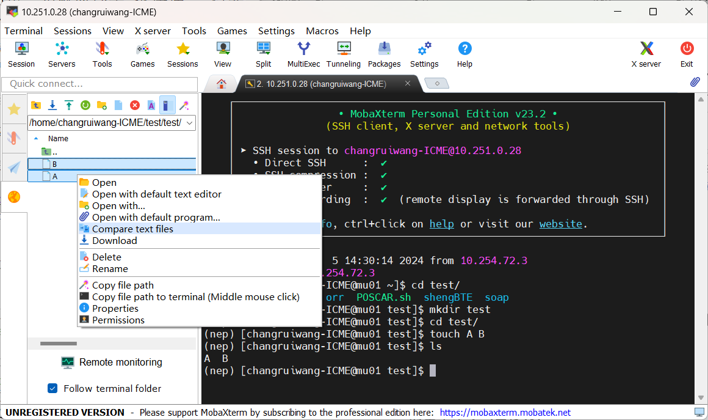

# 新生入门第一步

## MobaXterm 安装及使用

俗话说，“工欲善其事必先利其器”。
类似网购电子产品，我觉得新生入门第一步就应该是“拆快递”，得先把“快递”拿到手里折腾折腾再说。
这里的“快递”就是指咱们集群每个人的个人账号。

至于后续第一性原理计算会用到的软件如 VASP、CP2K 等可以慢慢学。
本节首先讲讲如何在 Windows 系统中使用 SSH（Secure Shell）客户端登录集群账号。

“网购”环节没啥好说的，首先你得自己找老师开通集群账号。

> 如果你觉得集群账号没有管理员权限不方便，可以自己在 Windows 里面安装一个 Linux 子系统 WSL2。安装过程非常简单。

SSH 客户端市面上有挺多，我此前使用的 XShell，后面也跟着师兄、师姐转投了 MobaXterm。

访问 [MobaXterm官网](https://mobaxterm.mobatek.net/download.html) 下载 MobaXterm 的安装包，解压后双击 `.msi` 文件根据提示安装。
打开软件后，点击左上角的 Session (会话控制)，在弹出的窗口中选择 SSH，输入 `Remote host`、`Specify username` 和 `Port=2022`，如图所示：

<div align="left">

</div>

首次登录时，需要输入管理员给的初始密码（注意密码是屏幕不可见的，敲键盘没响应不用惊讶），然后 Enter 确认进入个人账号。
登录成功后，第一件事是键入 `passwd` 命令根据提示修改密码。首次登录一定要修改初始密码，否则下次用初始密码登录时可能会提示 `access denied`，然后一脸尴尬地去找管理员重新设置初始密码。

MobaXterm 界面分为文件区（左）和终端区。
勾选左下角的 `Follow terminal folder` 可以让两个区块的路径保持一致。
文件传输和下载可以采用直接拖拽的方式。

MobaXterm 一个常用的功能是，在文件区选中两个文件 A 和 B，右键 `Compare text files` 可以直观地比较它们的异同并修改（比命令 `diff A B` 好用很多），如图所示：

<div align="left">

</div>

---

## Linux 的基本命令

Linux 命令行是一个强大的工具，它允许用户通过输入特定的命令来执行操作，管理文件和目录，配置网络和系统，以及执行许多其他任务。
对于初学者来说，掌握一些基本的 Linux 命令是非常重要的，这些命令包括文件操作、目录导航、权限设置和文件编辑等。

不熟悉 Linux 的基本命令时可以求助度娘，也可以参考 `Linux基础命令教程.chm`（在 /learning/notes/Linux/ 下面，需要本地打开），敲多了自然而然地就知道每个命令的含义。
可以使用 `man command` 查看 `command` 手册（例如，`man ls` 显示 `ls` 命令的详细介绍），并使用 `q` 退出手册。

刚开始不用太着急，初学者先学会并掌握下面列出的一些常用命令即可：
- `pwd` 是查看当前目录的绝对路径；
- `cd dir/` 是访问 `dir/` 文件夹；
- `ls dir/` 是查看 `dir/` 文件夹列表；
- `mkdir dir/` 是新建文件夹 `dir/`，**注意路径中最好不要出现中文**；
- `cp A B` 是把 `A` 复制为 `B`；
- `cp -r dir1/ dir2/` 是把文件夹 `dir1/` 复制为 `dir2/`；
- `mv A B` 是把 `A` 移动为 `B`；
- `rm A` 是删除文件 `A`；
- `rm -rf dir/` 是递归删除文件夹 `dir/`；
- `vi A` 是使用 VIM 文本编辑器编辑文件 `A`；
- `cat A` 是查看文件 `A` 的内容；
- `qsub runvasp.pbs` 是提交运行 VASP 程序的 PBS 脚本；

Linux 最常用的文本编辑器是 VIM。
如前所述，键入命令 `vi XXX` 即可编辑 `XXX` 文件（可以省去 `touch XXX` 创建空文件这一步骤）。
VIM 文本编辑器常用模式有四个：

1. Normal-mode：初始模式，在该模式下可以使用 VIM 快捷键，如 `dd` 剪切光标所在行，`yy` 复制光标所在行，`p` 粘贴行，`u` 撤销上一步操作等等，熟练掌握快捷键能极大地提高你的工作效率；

2. Insert-mode：在初始模式下键入 `i`、`a` 或者 `o` 进入文本编辑模式，编辑完成后需要键入 `Esc` 返回初始模式；

3. Command-mode：在初始模式下键入 `:` 进入命令行模式，键入 `wq` 即可保存退出，`q!` 是不保存退出，`set nu` 显示行号，`/str` 查找文本 `str`，`%s/旧文本/新文本/gc` 是替换旧文本为新文本，同样是 `Esc` 退出；

4. Visual-mode：在初始模式下键入 `v` 进入，`Esc` 退出；

在 `~/.vimrc` 中写入 `set number` 即可在 VIM 文本编辑器中显示行号。

> **ps**：
> 除了使用 VIM 文本编辑器，也可以使用命令 `sed` 或 `awk` 实现文本替换。
> 例如命令 `sed -i "s/A/B/g" XXX` 是替换 `XXX` 中的 `A` 为 `B`；
> 又如命令 `awk '{ gsub(/dft_forces/, "forces"); print $0 }' train.xyz > out.xyz` 是替换文本中的 `dft_forces` 为 `forces` 并输出到 `out.xyz` 文件中。
> 熟练掌握 VIM 编辑器后可以试一试，效率翻倍！

> **ps**：
> 使用别名 `alias` 可以极大提升工作效率。
> 例如，设置一个别名 `alias ll='ls -al'` 即可键入 `ll` 列出所有文件包括隐藏文件的详细信息。
> 如果要永久使用该别名，可以将该命令写入 `~/.bashrc` 配置文件（文件名前面加一个点表示隐藏文件）里面，然后 `source ~/.bashrc` 加载配置文件即可。
> 单独键入 `alias` 可以列出系统中已设置的所有别名。
> 下面给出我个人的 `~/.bashrc` 中的别名设置，仅供参考：
> 
> ```shell
> # User specific aliases and functions
> cdls(){
>     \cd "${1}";
>     ls;
> }
> alias cd='cdls'
> alias CD='cd'
> alias LS='ls'
> alias ..='cd ..'
> alias ...='cd ../..'
> alias ....='cd ../../..'
> alias ~='cd ~'
> alias ll='ls -al'
> alias untgz='tar -zxvf'
> alias untar='tar -xvf'
> alias s='qstat -u changruiwang-ICME'
> alias sq='qstat -q'
> alias spath='qstat -f | grep -A 1 Output_Path'
> alias q='showq'
> alias cp='cp -r'
> alias rmvasp='rm C* D* E* O* PC* R* W* X* output vasprun.xml IBZKPT *.[eo]1*'
> alias rmcp2k='rm cp2k.[eo]* cp2k[-_]*'
> alias rmgpumd='rm nep_*.txt nep.restart dump.xyz movie.xyz *.out output gpumd.[eo]* *.png'
> 
> alias dush='du -sh ./'                                   # 查看磁盘空间
> alias gpcm='grep cm-1 OUTCAR'                            # 查看 VASP 频率
> alias gpfi='grep f/i OUTCAR'                             # 查看 VASP 虚频
> alias gpdisp='grep Edisp OUTCAR | tail -1'               # 查看 VASP 色散矫正的能量
> alias gpfermi='grep E-fermi OUTCAR | tail -1'            # 查看 VASP 费米能级
> alias gpirr='grep irreducible OUTCAR'                    # 查看 VASP 体系的倒晶格基矢
> alias gpenmax='grep ENMAX POTCAR'                        # 查看 VASP 各个元素的截断能
> alias gpvol='grep volume OUTCAR'                         # 查看 VASP 体积
> alias gprra='grep required OUTCAR'                       # 查看 VASP 是否收敛
> alias gpconv="grep F= OSZICAR | awk '{print \$1,\$5}'"   # 查看 VASP 能量收敛情况
> alias gptit='grep TIT POTCAR'                            # 查看 VASP 赝势元素
> alias gptot='grep TOT OUTCAR'                            # 查看 VASP 能量
> alias gpzval='grep ZVAL OUTCAR'                          # 查看 VASP 价电子
> alias gpela='grep -A9 "TOTAL ELASTIC MODULI" OUTCAR'     # 查看 VASP 弹性常数结果
> alias gphes='grep hessian vasprun.xml'                   # 查看 VASP hessian 矩阵
> alias gpstep='grep = OSZICAR | tail'                     # 查看 VASP AIMD 当前步
> alias gpstatus='grep STATUS ML_LOGFILE | tail'           # 查看 VASP AIMD_MLFF 当前步
> alias cp2kene='grep = cp2k-pos-1.xyz'                    # 查看 CP2K 结构优化每个离子步的能量
> alias cp2kforce='grep Max\.\ g cp2k.out'                 # 查看 CP2K 结构优化每个离子步的受力
> alias cp2kcell='grep CELL cp2k.out'                      # 查看 CP2K 晶胞优化结果
> alias dprun='nohup dpgen run param.json machine.json 1>log 2>err &' # 运行 DPGEN
> alias dpcol='dpgen collect ./ ./collect -p param.json'   # 收集 DPGEN 数据
> alias gpbestcorr="grep Objective_function bestcorr*.out | sort -n -k 2" # 查看 ATAT mcsqs 生成的随机结构
> ```

---

## PBS 作业基本命令

常用的 PBS 作业基本命令有：
- `qsub *.pbs` 提交作业；
- `qstat` 查看自己的作业运行情况；
- `showq` 查看所有人的作业运行情况；
- `qdel jobid` 取消作业，`jobid` 通过 `qstat` 查看。

不常用的 PBS 作业命令例如：
- `qmove` 将作业移动到另一个队列；
- `pbsnodes` 列出集群中所有节点的状态和属性等。

PBS 脚本中 PBS 作业属性以 `#PBS` 的方式指定，其中
- `-N`：作业名称；
- `-l`：设定作业所需资源，`nodes` 设定作业所需节点资源，`ppn` 为节点的核数，`walltime` 设定作业所需的最大 wallclock 时间；
- `-q`：设定作业队列名称；
- `-S`：设定 `shell` 类型；
PBS 内置变量包括 `PBS_NODEFILE`（包含作业所用计算节点的文件名）、`PBS_O_WORKDIR`（执行 qsub 命令所在的绝对路径）、`PBS_QUEUE`（作业所执行的队列名称）、`PBS_JOBNAME`（用户指定的作业名称）等。

集群 3 的 VASP 作业提交脚本 `runvasp.pbs` 如下。
修改变量 `$EXEC` 可以执行不同的计算。

```shell
#PBS -N wchr
#PBS -l nodes=1:ppn=24
#PBS -l walltime=400:00:00
#PBS -q batch
#PBS -V
#PBS -S /bin/bash

source /opt/intel/compilers_and_libraries_2018/linux/bin/compilervars.sh intel64
source /opt/intel/mkl/bin/mklvars.sh intel64
source /opt/intel/impi/2018.1.163/bin64/mpivars.sh

NP=`cat $PBS_NODEFILE | wc -l`
NN=`cat $PBS_NODEFILE | sort | uniq | tee /tmp/nodes.$$ | wc -l`

cat $PBS_NODEFILE > /tmp/nodefile.$$
cd $PBS_O_WORKDIR
ulimit -s unlimited

EXEC=/opt/software/vasp/vasp6.4.0/bin/vasp_std
mpirun -machinefile $PBS_NODEFILE -np $NP $EXEC > output
```

批量提交作业请参考 [VASP 批量计算](https://github.com/wangchr1617/learning/blob/main/notes/VASP/VASP%E6%89%B9%E9%87%8F%E8%AE%A1%E7%AE%97.md) 。

--- 

## 使用集群上已经安装好的软件

在 Linux 中，当同一款编辑器、运行库、软件存在多个版本且多个版本都需要在不同的场景或人员使用时，配置这些内容的环境变量是一个非常繁琐的过程，而 module 工具则提供了一个简单快速的方法。
换言之，通过 module 你可以使用集群上已经安装好的软件。

使用 module 管理软件之前注意要在 `~/.bashrc` 文件中添加环境变量 `export MODULEPATH=/opt/modulefiles`。
新账号如果需要自己检查下 `~/.bashrc` 文件中有没有这一行。

常用的 module 命令如下：
- `module avail`：显示可以使用的模块
- `module load`：加载模块
- `module unload`：卸载模块
- `module list`：显示已经加载的模块

> **ps**：
> 一个小技巧是在 `~/.bashrc` 中添加命令 `module load XXX`，即可自动加载 `XXX` 软件。但是一定要慎重设置，避免调用其它软件时出现环境冲突。

下面列出集群 3 中已经安装的软件列表：

```
------------------------------- /opt/modulefiles -------------------------------
abinit/8.10.3                   lapack/3.7.0
alamode/1.1.0                   lobster/3.0.0
anaconda/3-python3.7.3(default) lobster/4.1.0
apptainer/1.0.0(default)        lobster/5.0.0
bader/1.04                      python/python-3.6.3
calypso/6                       qe/6.7
calypso/7                       scalapack/2.0.2
cmake/3.15.1(default)           ShengBTE/1.2.0(default)
cmake/3.18.5                    spglib/1.12.2
cp2k/7.1                        spglib/2.0.1(default)
cp2k/9.1(default)               uspex/2022.1.1
fftw/3.3.4(default)             vasp/5.4.4
gcc/5.4                         vasp/5.4.4_ifort(default)
gcc/7.4                         vasp/5.4.4_neb
gcc/9.3                         vasp/5.4.4_phonon
gibbs2/2020.10.07               vasp/5.4.4_wannier
go/1.17.7                       vasp/6.2.1
imscli/7.1.0                    vasp/6.3.0
intel/2015.1.133(default)       vasp/6.4.0
intel/2020.1.217                vasp/6.4.0_wannier31
jdftx/1.7.0                     wannier90/3.1.0
julia/1.8.5                     wannier90/310_vasp642
lammps/2020.10.29               yambo/4.5.1.r165
```

集群上有的软件一般就不要自己再重复安装了（除非管理员没有更新）。

例如，想要使用 Anaconda 可以直接 `module load anaconda/3-python3.7.3`，然后 `conda create -n XXX python=*` 创建指定版本号为 `*` 的 Python 环境 XXX，对应的环境路径就会自动添加到 `~/.conda/envs` 中。
但是集群现在限制联网，所以创建环境时进度条会卡住。
如果你要求不高 Python 3.7 也能将就，那么 `conda create -n XXX --clone base` 克隆 base 环境就好。
否则，还是自己安装一个 Anaconda 吧，见 [Anaconda 安装](https://github.com/wangchr1617/learning/blob/main/notes/Python/Anaconda%E5%AE%89%E8%A3%85.md) 。

---